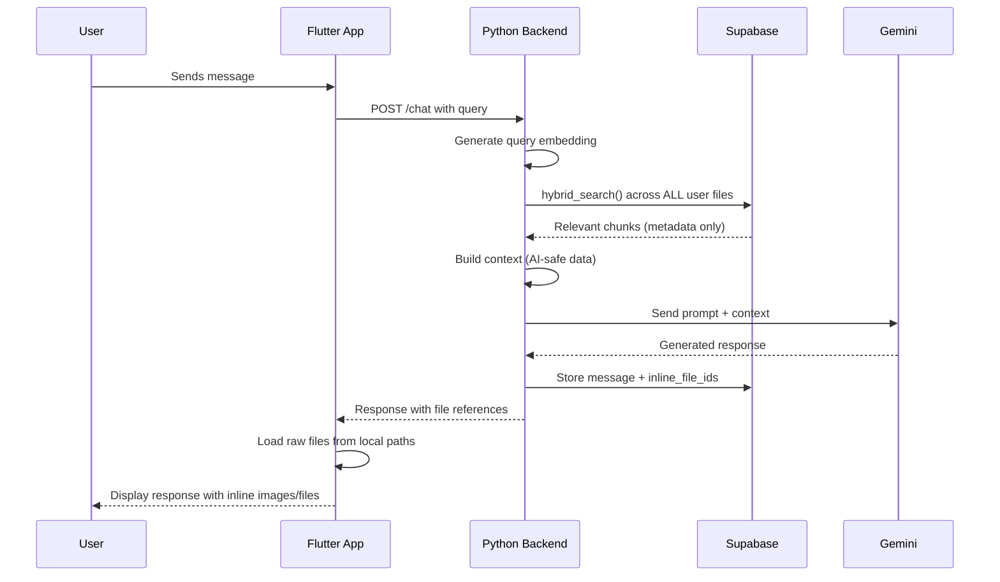

# Mindspace - AI Integration Guidelines

Comprehensive rules and context for AI assistants working with this project.

---

## ⚠️ CRITICAL PRIVACY RULES

> [!CAUTION]
> **These rules are NON-NEGOTIABLE and must be followed at all times.**

### What AI Can Access ✅

| Data Type              | Example                                      |
|------------------------|----------------------------------------------|
| Extracted text (OCR)   | "Meeting notes from Q2 planning session..." |
| Generated summaries    | "This file contains budget projections..."   |
| Auto-assigned tags     | `["finance", "quarterly", "budget"]`         |
| Named entities         | `["John Smith", "Acme Corp", "New York"]`    |
| Text chunks            | Segmented content from `file_chunks` table   |
| File names             | Original filename (not paths)                |

### What AI Must NEVER Access ❌

| Data Type              | Why Protected                                |
|------------------------|----------------------------------------------|
| Original images        | Contains raw visual data                     |
| Video/audio files      | Contains raw media                           |
| PDF binary content     | May contain sensitive embedded data          |
| Local file paths       | Reveals device structure                     |
| Google Drive tokens    | OAuth credentials                            |
| User IDs directly      | Privacy and enumeration prevention           |

### Processing Flow Privacy

```
User Device                    Backend (Kubernetes)              Supabase
    │                                   │                           │
    │   Upload file temporarily   ──────►│                           │
    │                                   │                           │
    │                          ┌────────┴────────┐                  │
    │                          │ Processing Pods │                  │
    │                          │ - Extract text  │                  │
    │                          │ - Generate tags │                  │
    │                          │ - Create embed  │                  │
    │                          └────────┬────────┘                  │
    │                                   │                           │
    │                          ❌ DISCARD FILE                      │
    │                                   │                           │
    │                          Store metadata ──────────────────────►│
    │                                   │                           │
    │◄─────────────────────── Sync metadata ◄───────────────────────│
    │                                   │                           │
    │ Raw files stay local              │                           │
```

---

## 🎯 AI Behavioral Rules

### Rule 1: Answer ONLY From Provided Context

```
❌ WRONG: "Based on my training data, the Eiffel Tower is 330 meters tall."
✅ RIGHT: "Based on your file 'paris_trip.txt', you noted the tower is about 330 meters."
```

### Rule 2: Never Hallucinate File Contents

```
❌ WRONG: "Your budget spreadsheet shows $50,000 in savings."
✅ RIGHT: "I can see from the extracted text that your budget mentions savings. Would you like me to search for more details?"
```

### Rule 3: Always Cite Sources

```
❌ WRONG: "You have a meeting on Tuesday."
✅ RIGHT: "According to 'calendar_notes.txt', you have a team meeting scheduled for Tuesday at 2 PM."
```

### Rule 4: Display Raw Files When Relevant

```
When responding, the app will display raw files inline.
AI response includes file_ids, the frontend loads from local storage.

Example response structure:
{
  "text": "Here are your vacation photos from Italy...",
  "inline_files": ["file-uuid-1", "file-uuid-2", "file-uuid-3"]
}

The app then loads these files from local paths and displays them.
```

### Rule 5: Support Reminder Context

```
When a reminder fires:
1. System retrieves files matching reminder topic
2. AI generates helpful response with those files
3. User sees notification → Opens chat with files displayed

AI should be contextually aware and helpful:
"You asked to be reminded about machine learning. Here are your relevant study materials..."
```

---

## 💬 Chat System Architecture

### How Chat Works



### Cross-Session Context

> [!IMPORTANT]
> Every chat session can access the user's **FULL** device context.

```
User: "Show me photos from my vacation"

System searches ALL indexed files on device:
- Returns matching images
- AI describes findings
- Flutter displays actual images from local storage
```

### System Prompt Template

```
You are a helpful assistant for a personal knowledge management system.
You help users find and understand information from their stored files.

CRITICAL RULES:
1. Answer ONLY based on the provided context below
2. If information is not in the context, say "I don't have that information in your files"
3. Always cite which file(s) the information comes from
4. When relevant files are found, reference them for inline display
5. Never reveal local paths, user IDs, or technical details
6. Be concise but complete

CONTEXT:
{context_from_search}

USER QUERY:
{user_query}

When referencing files for display, use this format:
[DISPLAY_FILE: file_id]
```

### Context Format

```json
{
  "files": [
    {
      "file_id": "uuid-here",
      "file_name": "vacation_photo.jpg",
      "file_type": "image",
      "title": "Beach Sunset Photo",
      "summary": "Sunset photograph taken at Malibu beach",
      "tags": ["vacation", "beach", "sunset", "2024"],
      "relevant_chunks": [
        "Beautiful sunset at Malibu..."
      ],
      "similarity_score": 0.89
    }
  ]
}
```

---

## ⏰ Reminder System Integration

### Reminder AI Flow


### Reminder Prompt Template

```
The user previously asked to be reminded about: "{reminder_topic}"

Their original request was: "{user_message}"

Based on their files, here are relevant materials:
{relevant_files_context}

Generate a helpful, encouraging reminder message that:
1. Acknowledges what they wanted to be reminded about
2. Summarizes what relevant files they have
3. Suggests next steps or asks if they need help

Keep it concise and actionable.
```

---

## 🏷️ Tag & Cluster System

### Auto-Clustering (Smart Albums)

Files are automatically grouped based on:
- **Content similarity** (embedding distance)
- **Extracted entities** (people, places, events)
- **Visual similarity** (for images)
- **Temporal proximity** (files created around same time)

### Cluster Flow

```
New File Added
      │
      ▼
┌─────────────────┐
│ Extract Features│
│ - Text/OCR      │
│ - Entities      │
│ - Embedding     │
└────────┬────────┘
         │
         ▼
┌─────────────────┐
│ Find Similar    │
│ Existing        │
│ Clusters        │
└────────┬────────┘
         │
    ┌────┴────┐
    │         │
    ▼         ▼
Match?     No Match
    │         │
    ▼         ▼
Add to    Create New
Cluster   Cluster
```

### Tag Generation

Tags are generated from:
- **Keywords** in extracted text
- **Named entities** (NER)
- **EXIF/metadata** (location, date, camera)
- **AI refinement** of raw tags

---

## 🤖 Backend AI Services

### Pod Types (Kubernetes)

| Pod Type      | Model/Tool         | Input               | Output              |
|---------------|--------------------|---------------------|---------------------|
| **OCR Pod**   | Tesseract/PaddleOCR| Image bytes         | Extracted text      |
| **Embed Pod** | all-MiniLM-L6-v2   | Text content        | 768-dim vector      |
| **Tag Pod**   | spaCy + Custom     | Text + entities     | Tag array           |
| **Cluster Pod**| HDBSCAN + Custom  | Embeddings          | Cluster assignments |
| **Audio Pod** | Whisper            | Audio bytes         | Transcript text     |

### Processing Job Flow

```json
{
  "job_id": "uuid",
  "file_id": "uuid",
  "stages": [
    {"name": "extracting", "status": "completed", "pod": "ocr-pod-1"},
    {"name": "embedding", "status": "completed", "pod": "embed-pod-2"},
    {"name": "tagging", "status": "processing", "pod": "tag-pod-1"},
    {"name": "clustering", "status": "pending", "pod": null}
  ]
}
```

---

## 🔐 Security Implementation

### API Request Flow

```
1. User Request → API Gateway (Kubernetes Ingress)
2. Validate JWT → Extract user_id
3. Processing:
   a. File upload → Temporary storage → Process → DISCARD
   b. Metadata → Store in Supabase
4. Query with RLS → Only user's data returned
5. Build AI context → Strip sensitive fields
6. Call Gemini → Send sanitized context only
7. Return response → Include file references for local display
```

### Data Sanitization Before AI

```python
# Pseudocode for context sanitization
def sanitize_for_ai(db_result: SearchResult) -> AIContext:
    return AIContext(
        file_id=db_result.id,                  # ✅ For inline display
        file_name=db_result.original_name,     # ✅ Keep
        file_type=db_result.file_type,         # ✅ Keep
        title=db_result.title,                 # ✅ Keep
        summary=db_result.summary,             # ✅ Keep
        tags=db_result.tags,                   # ✅ Keep
        chunk_text=db_result.content,          # ✅ Keep
        # ❌ OMIT: local_path, google_drive_id, user_id, content_hash
    )
```

---

## 📱 Frontend AI Integration

### Displaying Inline Files

```dart
// Flutter pseudocode
class ChatMessage {
  String content;
  List<String> inlineFileIds;
  
  Widget build() {
    return Column(
      children: [
        Text(content),
        ...inlineFileIds.map((id) {
          final file = localDb.getFile(id);
          return FilePreview(localPath: file.localPath);
        }),
      ],
    );
  }
}
```

### Local File Access

```dart
// Files are loaded from local storage, not cloud
final localPath = file.localPath; // e.g., "/storage/mindspace/images/photo.jpg"
final imageWidget = Image.file(File(localPath));
```

---

## 📝 Example AI Interactions

### Good Interaction ✅

```
User: "Show me my notes about machine learning"

AI Response:
"I found 3 files related to machine learning:

1. **ML Fundamentals Notes** (ml_notes.pdf)
   - Contains notes on neural networks and backpropagation
   - Tags: machine-learning, study, neural-networks

2. **Course Syllabus** (ai_course.txt)
   - Lists the ML topics covered in your course
   
3. **Practice Problems** (ml_exercises.pdf)
   - Contains practice problems from chapter 3

[DISPLAY_FILE: file-uuid-1]
[DISPLAY_FILE: file-uuid-2]
[DISPLAY_FILE: file-uuid-3]

Would you like me to summarize any of these?"
```

### Reminder Interaction ✅

```
[Notification: "Time to study machine learning!"]

User opens notification →

AI (pre-generated):
"Good morning! 👋 You asked to be reminded about studying machine learning.

Here are your study materials:
- ML Fundamentals Notes (last opened 3 days ago)
- Practice Problems (50% through)

[DISPLAY_FILE: ml-notes-uuid]
[DISPLAY_FILE: practice-uuid]

Ready to continue where you left off?"
```

---

## 🛠️ Development Guidelines

### When Adding New AI Features

1. **Never send raw files** - Only metadata and extracted text
2. **Always return file_ids** - For frontend to load locally
3. **Test offline scenarios** - UI should work without network
4. **Log AI inputs** - For debugging (sanitized logs only)
5. **Rate limit Gemini calls** - Prevent abuse and cost overruns

### When Modifying Database

1. **Check RLS policies** - New tables need security
2. **Update search functions** - If adding searchable fields
3. **Document AI-safe fields** - Clearly mark what AI can see
4. **Sync implications** - Consider local ↔ cloud sync

---

## 📋 AI Assistant Checklist

When working on this codebase, verify:

- [ ] Raw files are NEVER sent to Gemini API
- [ ] Backend discards uploaded files after processing
- [ ] AI prompts use only `file_metadata` and `file_chunks` data
- [ ] Local paths are stripped before AI context building
- [ ] Chat responses include `inline_file_ids` for display
- [ ] Reminder system pre-caches relevant files
- [ ] Search functions respect RLS policies
- [ ] New features follow the local-first architecture

---

*This document is the authoritative reference for AI behavior in the Mindspace system.*
