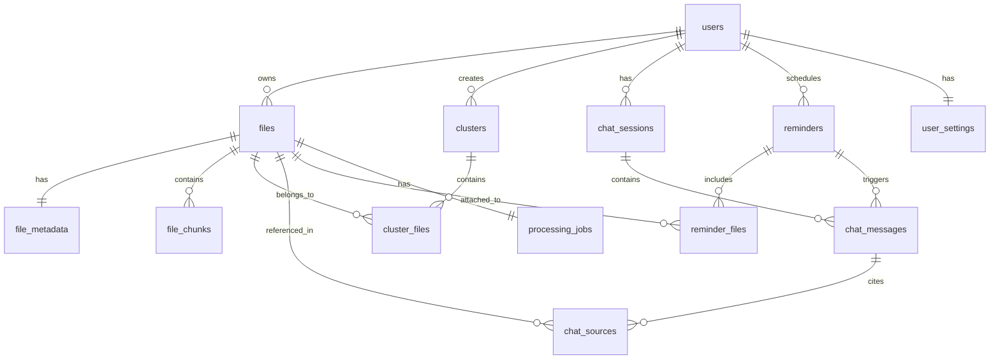

# Mindspace - Database Schema

Complete Supabase PostgreSQL schema with pgvector for semantic search.
Local-first architecture with cloud sync for metadata only.

---

## 🔧 Prerequisites

Before creating tables, enable required extensions:

```sql
-- Enable UUID generation
CREATE EXTENSION IF NOT EXISTS "uuid-ossp";

-- Enable vector operations for semantic search
CREATE EXTENSION IF NOT EXISTS "vector";

-- Enable full-text search improvements
CREATE EXTENSION IF NOT EXISTS "pg_trgm";
```

---

## 📊 Entity Relationship Diagram



---

## 📁 Table Definitions

### 1️⃣ `users_settings` - User Configuration

Stores user preferences and external service connections.

```sql
-- =============================================================================
-- TABLE: user_settings
-- PURPOSE: User preferences and external connections
-- =============================================================================

CREATE TABLE public.user_settings (
    id UUID PRIMARY KEY DEFAULT uuid_generate_v4(),
    user_id UUID NOT NULL UNIQUE REFERENCES auth.users(id) ON DELETE CASCADE,
    
    -- Google Drive Integration (Optional)
    google_drive_linked BOOLEAN DEFAULT false,
    google_drive_folder_id TEXT,              -- Root backup folder ID
    google_drive_refresh_token TEXT,          -- Encrypted OAuth token
    google_drive_last_sync TIMESTAMPTZ,
    
    -- Notification Settings
    fcm_token TEXT,                           -- Firebase Cloud Messaging token
    notifications_enabled BOOLEAN DEFAULT true,
    reminder_default_time TIME DEFAULT '09:00:00',
    
    -- Sync Settings
    auto_sync_enabled BOOLEAN DEFAULT true,
    sync_on_wifi_only BOOLEAN DEFAULT true,
    last_sync_at TIMESTAMPTZ,
    
    -- Processing Preferences
    auto_process_new_files BOOLEAN DEFAULT true,
    preferred_language TEXT DEFAULT 'en',
    
    -- Timestamps
    created_at TIMESTAMPTZ DEFAULT NOW(),
    updated_at TIMESTAMPTZ DEFAULT NOW()
);

-- Row Level Security
ALTER TABLE public.user_settings ENABLE ROW LEVEL SECURITY;

CREATE POLICY "Users can only access their own settings"
    ON public.user_settings
    FOR ALL
    USING (auth.uid() = user_id)
    WITH CHECK (auth.uid() = user_id);
```

---

### 2️⃣ `files` - Core File Registry

Stores file identity with local path, Google Drive path, and content hash.

```sql
-- =============================================================================
-- TABLE: files
-- PURPOSE: Master record for all user files with local + cloud paths
-- PRIVACY: Contains local paths - sensitive but synced for cross-device
-- =============================================================================

CREATE TABLE public.files (
    id UUID PRIMARY KEY DEFAULT uuid_generate_v4(),
    user_id UUID NOT NULL REFERENCES auth.users(id) ON DELETE CASCADE,
    
    -- File Identity
    original_name TEXT NOT NULL,
    file_type TEXT NOT NULL CHECK (file_type IN ('image', 'video', 'audio', 'pdf', 'text', 'link')),
    mime_type TEXT,
    
    -- Local Storage (Primary)
    local_path TEXT NOT NULL,                  -- Absolute path on device
    local_thumbnail_path TEXT,                 -- Path to generated thumbnail
    
    -- Google Drive Backup (Optional)
    google_drive_file_id TEXT,                 -- Drive file ID if backed up
    google_drive_path TEXT,                    -- Path in Drive folder
    
    -- Deduplication
    content_hash TEXT NOT NULL,                -- SHA-256 hash of file content
    
    -- File Properties
    size_bytes BIGINT DEFAULT 0,
    
    -- Sync & Versioning
    local_modified_at TIMESTAMPTZ,            -- Last modified on device
    is_deleted BOOLEAN DEFAULT false,          -- Soft delete for sync
    sync_status TEXT DEFAULT 'pending' CHECK (
        sync_status IN ('pending', 'synced', 'conflict', 'local_only')
    ),
    
    -- Timestamps
    created_at TIMESTAMPTZ DEFAULT NOW(),
    updated_at TIMESTAMPTZ DEFAULT NOW()
);

-- Indexes
CREATE INDEX idx_files_user_id ON public.files(user_id);
CREATE INDEX idx_files_file_type ON public.files(file_type);
CREATE INDEX idx_files_content_hash ON public.files(user_id, content_hash);
CREATE INDEX idx_files_sync_status ON public.files(sync_status);
CREATE INDEX idx_files_created_at ON public.files(created_at DESC);

-- Unique constraint for deduplication per user
CREATE UNIQUE INDEX idx_files_user_hash ON public.files(user_id, content_hash) 
    WHERE is_deleted = false;

-- Row Level Security
ALTER TABLE public.files ENABLE ROW LEVEL SECURITY;

CREATE POLICY "Users can only access their own files"
    ON public.files
    FOR ALL
    USING (auth.uid() = user_id)
    WITH CHECK (auth.uid() = user_id);

-- Update timestamp trigger
CREATE OR REPLACE FUNCTION update_updated_at()
RETURNS TRIGGER AS $$
BEGIN
    NEW.updated_at = NOW();
    RETURN NEW;
END;
$$ LANGUAGE plpgsql;

CREATE TRIGGER files_updated_at
    BEFORE UPDATE ON public.files
    FOR EACH ROW
    EXECUTE FUNCTION update_updated_at();
```

---

### 3️⃣ `file_metadata` - AI-Safe Extracted Information

Contains extracted text, summaries, and tags. **This is safe to share with AI.**

```sql
-- =============================================================================
-- TABLE: file_metadata
-- PURPOSE: Extracted, AI-safe information from files
-- PRIVACY: ✅ SAFE TO SHARE WITH AI - No original file content
-- =============================================================================

CREATE TABLE public.file_metadata (
    id UUID PRIMARY KEY DEFAULT uuid_generate_v4(),
    file_id UUID NOT NULL UNIQUE REFERENCES public.files(id) ON DELETE CASCADE,
    
    -- Core Metadata (AI-SAFE)
    title TEXT,                              -- Generated or extracted title
    summary TEXT,                            -- AI-generated summary
    extracted_text TEXT,                     -- OCR/transcription output
    
    -- Classification (AI-SAFE)
    tags TEXT[] DEFAULT '{}',                -- Auto-generated tags
    entities TEXT[] DEFAULT '{}',            -- Named entities (people, places, orgs)
    
    -- Extended Metadata (AI-SAFE)
    extra JSONB DEFAULT '{}'::jsonb,         -- EXIF, document properties, etc.
    
    -- Visual Properties (for images/videos)
    dominant_colors TEXT[],                  -- For visual similarity
    scene_description TEXT,                  -- AI-described scene
    
    -- Processing State
    processing_status TEXT DEFAULT 'pending' CHECK (
        processing_status IN ('pending', 'processing', 'completed', 'failed')
    ),
    processing_error TEXT,
    processed_at TIMESTAMPTZ,
    
    -- Timestamps
    created_at TIMESTAMPTZ DEFAULT NOW(),
    updated_at TIMESTAMPTZ DEFAULT NOW()
);

-- Indexes
CREATE INDEX idx_file_metadata_file_id ON public.file_metadata(file_id);
CREATE INDEX idx_file_metadata_tags ON public.file_metadata USING GIN(tags);
CREATE INDEX idx_file_metadata_entities ON public.file_metadata USING GIN(entities);
CREATE INDEX idx_file_metadata_status ON public.file_metadata(processing_status);

-- Full-text search index
CREATE INDEX idx_file_metadata_fts ON public.file_metadata 
    USING GIN(to_tsvector('english', 
        COALESCE(title, '') || ' ' || 
        COALESCE(summary, '') || ' ' || 
        COALESCE(extracted_text, '')
    ));

-- Row Level Security
ALTER TABLE public.file_metadata ENABLE ROW LEVEL SECURITY;

CREATE POLICY "Users can only access their own file metadata"
    ON public.file_metadata
    FOR ALL
    USING (
        EXISTS (
            SELECT 1 FROM public.files 
            WHERE files.id = file_metadata.file_id 
            AND files.user_id = auth.uid()
        )
    );

CREATE TRIGGER file_metadata_updated_at
    BEFORE UPDATE ON public.file_metadata
    FOR EACH ROW
    EXECUTE FUNCTION update_updated_at();
```

---

### 4️⃣ `file_chunks` - Vector Search Core

Stores chunked content with embeddings for semantic search.

```sql
-- =============================================================================
-- TABLE: file_chunks
-- PURPOSE: Chunked content with vector embeddings for semantic search
-- PRIVACY: Contains extracted text chunks - AI can search these
-- =============================================================================

CREATE TABLE public.file_chunks (
    id UUID PRIMARY KEY DEFAULT uuid_generate_v4(),
    file_id UUID NOT NULL REFERENCES public.files(id) ON DELETE CASCADE,
    
    -- Chunk Identity
    chunk_index INTEGER NOT NULL,            -- Order within file
    
    -- Content (AI-accessible for RAG)
    content TEXT NOT NULL,                   -- Chunk text content
    
    -- Vector Embedding for Semantic Search
    embedding vector(768),                   -- Dimension depends on model
    
    -- Optional Metadata
    start_offset INTEGER,                    -- Character offset in original
    end_offset INTEGER,
    
    -- Timestamps
    created_at TIMESTAMPTZ DEFAULT NOW(),
    
    CONSTRAINT unique_file_chunk UNIQUE (file_id, chunk_index)
);

-- Indexes
CREATE INDEX idx_file_chunks_file_id ON public.file_chunks(file_id);
CREATE INDEX idx_file_chunks_order ON public.file_chunks(file_id, chunk_index);

-- Vector similarity search index (HNSW for better performance)
CREATE INDEX idx_file_chunks_embedding ON public.file_chunks 
    USING hnsw (embedding vector_cosine_ops);

-- Row Level Security
ALTER TABLE public.file_chunks ENABLE ROW LEVEL SECURITY;

CREATE POLICY "Users can only access their own file chunks"
    ON public.file_chunks
    FOR ALL
    USING (
        EXISTS (
            SELECT 1 FROM public.files 
            WHERE files.id = file_chunks.file_id 
            AND files.user_id = auth.uid()
        )
    );
```

---

### 5️⃣ `clusters` - Auto-Generated Tag Groups (Albums)

```sql
-- =============================================================================
-- TABLE: clusters
-- PURPOSE: AI-generated logical groupings (like smart albums)
-- =============================================================================

CREATE TABLE public.clusters (
    id UUID PRIMARY KEY DEFAULT uuid_generate_v4(),
    user_id UUID NOT NULL REFERENCES auth.users(id) ON DELETE CASCADE,
    
    -- Cluster Identity
    label TEXT NOT NULL,                     -- Display name (e.g., "Vacation 2024")
    description TEXT,                        -- AI-generated description
    cluster_type TEXT DEFAULT 'auto' CHECK (
        cluster_type IN ('auto', 'manual', 'smart')
    ),
    
    -- Visual Representation
    cover_file_id UUID REFERENCES public.files(id) ON DELETE SET NULL,
    color TEXT,                              -- Hex color for UI
    icon TEXT,                               -- Icon identifier
    
    -- Confidence & Stats
    confidence FLOAT DEFAULT 0.0 CHECK (confidence >= 0 AND confidence <= 1),
    file_count INTEGER DEFAULT 0,
    
    -- Timestamps
    created_at TIMESTAMPTZ DEFAULT NOW(),
    updated_at TIMESTAMPTZ DEFAULT NOW()
);

-- Indexes
CREATE INDEX idx_clusters_user_id ON public.clusters(user_id);
CREATE INDEX idx_clusters_type ON public.clusters(cluster_type);
CREATE INDEX idx_clusters_label ON public.clusters(user_id, label);

-- Row Level Security
ALTER TABLE public.clusters ENABLE ROW LEVEL SECURITY;

CREATE POLICY "Users can only access their own clusters"
    ON public.clusters
    FOR ALL
    USING (auth.uid() = user_id)
    WITH CHECK (auth.uid() = user_id);

CREATE TRIGGER clusters_updated_at
    BEFORE UPDATE ON public.clusters
    FOR EACH ROW
    EXECUTE FUNCTION update_updated_at();
```

---

### 6️⃣ `cluster_files` - File-Cluster Relationships

```sql
-- =============================================================================
-- TABLE: cluster_files
-- PURPOSE: Links files to clusters (many-to-many)
-- =============================================================================

CREATE TABLE public.cluster_files (
    id UUID PRIMARY KEY DEFAULT uuid_generate_v4(),
    cluster_id UUID NOT NULL REFERENCES public.clusters(id) ON DELETE CASCADE,
    file_id UUID NOT NULL REFERENCES public.files(id) ON DELETE CASCADE,
    
    -- Assignment Metadata
    similarity_score FLOAT DEFAULT 0.0,      -- How well file fits cluster
    is_manual BOOLEAN DEFAULT false,         -- User manually assigned
    
    -- Timestamps
    assigned_at TIMESTAMPTZ DEFAULT NOW(),
    
    CONSTRAINT unique_cluster_file UNIQUE (cluster_id, file_id)
);

-- Indexes
CREATE INDEX idx_cluster_files_cluster ON public.cluster_files(cluster_id);
CREATE INDEX idx_cluster_files_file ON public.cluster_files(file_id);

-- Row Level Security
ALTER TABLE public.cluster_files ENABLE ROW LEVEL SECURITY;

CREATE POLICY "Users can only access their own cluster assignments"
    ON public.cluster_files
    FOR ALL
    USING (
        EXISTS (
            SELECT 1 FROM public.clusters 
            WHERE clusters.id = cluster_files.cluster_id 
            AND clusters.user_id = auth.uid()
        )
    );

-- Function to update cluster file count
CREATE OR REPLACE FUNCTION update_cluster_file_count()
RETURNS TRIGGER AS $$
BEGIN
    IF TG_OP = 'INSERT' THEN
        UPDATE public.clusters SET file_count = file_count + 1 WHERE id = NEW.cluster_id;
    ELSIF TG_OP = 'DELETE' THEN
        UPDATE public.clusters SET file_count = file_count - 1 WHERE id = OLD.cluster_id;
    END IF;
    RETURN COALESCE(NEW, OLD);
END;
$$ LANGUAGE plpgsql;

CREATE TRIGGER cluster_files_count
    AFTER INSERT OR DELETE ON public.cluster_files
    FOR EACH ROW
    EXECUTE FUNCTION update_cluster_file_count();
```

---

### 7️⃣ `chat_sessions` - Conversation Containers

```sql
-- =============================================================================
-- TABLE: chat_sessions
-- PURPOSE: Container for chat conversations
-- NOTE: Each session can access FULL device context
-- =============================================================================

CREATE TABLE public.chat_sessions (
    id UUID PRIMARY KEY DEFAULT uuid_generate_v4(),
    user_id UUID NOT NULL REFERENCES auth.users(id) ON DELETE CASCADE,
    
    -- Session Metadata
    title TEXT DEFAULT 'New Chat',
    
    -- Chat Settings
    search_mode TEXT DEFAULT 'hybrid' CHECK (
        search_mode IN ('text', 'semantic', 'hybrid')
    ),
    
    -- Context Scope (for cross-session context)
    context_scope TEXT DEFAULT 'full' CHECK (
        context_scope IN ('full', 'session_only', 'selected_files')
    ),
    
    -- Linked Reminder (if triggered by reminder)
    triggered_by_reminder_id UUID,
    
    -- Timestamps
    created_at TIMESTAMPTZ DEFAULT NOW(),
    updated_at TIMESTAMPTZ DEFAULT NOW()
);

-- Indexes
CREATE INDEX idx_chat_sessions_user ON public.chat_sessions(user_id);
CREATE INDEX idx_chat_sessions_recent ON public.chat_sessions(updated_at DESC);

-- Row Level Security
ALTER TABLE public.chat_sessions ENABLE ROW LEVEL SECURITY;

CREATE POLICY "Users can only access their own chat sessions"
    ON public.chat_sessions
    FOR ALL
    USING (auth.uid() = user_id)
    WITH CHECK (auth.uid() = user_id);

CREATE TRIGGER chat_sessions_updated_at
    BEFORE UPDATE ON public.chat_sessions
    FOR EACH ROW
    EXECUTE FUNCTION update_updated_at();
```

---

### 8️⃣ `chat_messages` - Message History

```sql
-- =============================================================================
-- TABLE: chat_messages
-- PURPOSE: Individual messages within chat sessions
-- =============================================================================

CREATE TABLE public.chat_messages (
    id UUID PRIMARY KEY DEFAULT uuid_generate_v4(),
    session_id UUID NOT NULL REFERENCES public.chat_sessions(id) ON DELETE CASCADE,
    
    -- Message Content
    role TEXT NOT NULL CHECK (role IN ('user', 'assistant', 'system')),
    content TEXT NOT NULL,
    
    -- Inline File References (for displaying raw files in chat)
    inline_file_ids UUID[] DEFAULT '{}',     -- Files to display in response
    
    -- AI Metadata
    tokens_used INTEGER,
    model_used TEXT DEFAULT 'gemini-1.5-flash',
    
    -- Timestamps
    created_at TIMESTAMPTZ DEFAULT NOW()
);

-- Indexes
CREATE INDEX idx_chat_messages_session ON public.chat_messages(session_id);
CREATE INDEX idx_chat_messages_order ON public.chat_messages(session_id, created_at);

-- Row Level Security
ALTER TABLE public.chat_messages ENABLE ROW LEVEL SECURITY;

CREATE POLICY "Users can only access their own chat messages"
    ON public.chat_messages
    FOR ALL
    USING (
        EXISTS (
            SELECT 1 FROM public.chat_sessions 
            WHERE chat_sessions.id = chat_messages.session_id 
            AND chat_sessions.user_id = auth.uid()
        )
    );
```

---

### 9️⃣ `chat_sources` - Message Citations

```sql
-- =============================================================================
-- TABLE: chat_sources
-- PURPOSE: Tracks which files were used to generate AI responses
-- =============================================================================

CREATE TABLE public.chat_sources (
    id UUID PRIMARY KEY DEFAULT uuid_generate_v4(),
    message_id UUID NOT NULL REFERENCES public.chat_messages(id) ON DELETE CASCADE,
    file_id UUID NOT NULL REFERENCES public.files(id) ON DELETE CASCADE,
    
    -- Source Details
    chunk_ids UUID[],                        -- Specific chunks used
    relevance_score FLOAT,                   -- How relevant to the query
    
    -- Timestamps
    created_at TIMESTAMPTZ DEFAULT NOW()
);

-- Indexes
CREATE INDEX idx_chat_sources_message ON public.chat_sources(message_id);
CREATE INDEX idx_chat_sources_file ON public.chat_sources(file_id);

-- Row Level Security
ALTER TABLE public.chat_sources ENABLE ROW LEVEL SECURITY;

CREATE POLICY "Users can only access their own chat sources"
    ON public.chat_sources
    FOR ALL
    USING (
        EXISTS (
            SELECT 1 FROM public.chat_messages 
            JOIN public.chat_sessions ON chat_sessions.id = chat_messages.session_id
            WHERE chat_messages.id = chat_sources.message_id 
            AND chat_sessions.user_id = auth.uid()
        )
    );
```

---

### 🔟 `reminders` - Scheduled Notifications

```sql
-- =============================================================================
-- TABLE: reminders
-- PURPOSE: User-scheduled reminders with topic context
-- =============================================================================

CREATE TABLE public.reminders (
    id UUID PRIMARY KEY DEFAULT uuid_generate_v4(),
    user_id UUID NOT NULL REFERENCES auth.users(id) ON DELETE CASCADE,
    
    -- Reminder Content
    title TEXT NOT NULL,                     -- Brief title
    topic TEXT NOT NULL,                     -- Topic for AI context retrieval
    user_message TEXT,                       -- Original user request
    
    -- Schedule
    scheduled_at TIMESTAMPTZ NOT NULL,       -- When to send notification
    recurrence TEXT CHECK (
        recurrence IN ('none', 'daily', 'weekly', 'monthly')
    ) DEFAULT 'none',
    
    -- Status
    status TEXT DEFAULT 'pending' CHECK (
        status IN ('pending', 'sent', 'dismissed', 'snoozed', 'cancelled')
    ),
    sent_at TIMESTAMPTZ,
    
    -- Linked Chat (created when reminder fires)
    triggered_chat_session_id UUID REFERENCES public.chat_sessions(id),
    
    -- Timestamps
    created_at TIMESTAMPTZ DEFAULT NOW(),
    updated_at TIMESTAMPTZ DEFAULT NOW()
);

-- Indexes
CREATE INDEX idx_reminders_user ON public.reminders(user_id);
CREATE INDEX idx_reminders_scheduled ON public.reminders(scheduled_at) 
    WHERE status = 'pending';
CREATE INDEX idx_reminders_status ON public.reminders(status);

-- Row Level Security
ALTER TABLE public.reminders ENABLE ROW LEVEL SECURITY;

CREATE POLICY "Users can only access their own reminders"
    ON public.reminders
    FOR ALL
    USING (auth.uid() = user_id)
    WITH CHECK (auth.uid() = user_id);

CREATE TRIGGER reminders_updated_at
    BEFORE UPDATE ON public.reminders
    FOR EACH ROW
    EXECUTE FUNCTION update_updated_at();
```

---

### 1️⃣1️⃣ `reminder_files` - Files Attached to Reminders

```sql
-- =============================================================================
-- TABLE: reminder_files
-- PURPOSE: Files relevant to a reminder's topic
-- =============================================================================

CREATE TABLE public.reminder_files (
    id UUID PRIMARY KEY DEFAULT uuid_generate_v4(),
    reminder_id UUID NOT NULL REFERENCES public.reminders(id) ON DELETE CASCADE,
    file_id UUID NOT NULL REFERENCES public.files(id) ON DELETE CASCADE,
    
    -- Relevance
    relevance_score FLOAT,
    
    -- Timestamps
    created_at TIMESTAMPTZ DEFAULT NOW(),
    
    CONSTRAINT unique_reminder_file UNIQUE (reminder_id, file_id)
);

-- Indexes
CREATE INDEX idx_reminder_files_reminder ON public.reminder_files(reminder_id);
CREATE INDEX idx_reminder_files_file ON public.reminder_files(file_id);

-- Row Level Security
ALTER TABLE public.reminder_files ENABLE ROW LEVEL SECURITY;

CREATE POLICY "Users can only access their own reminder files"
    ON public.reminder_files
    FOR ALL
    USING (
        EXISTS (
            SELECT 1 FROM public.reminders 
            WHERE reminders.id = reminder_files.reminder_id 
            AND reminders.user_id = auth.uid()
        )
    );
```

---

### 1️⃣2️⃣ `processing_jobs` - Background Task Tracking

```sql
-- =============================================================================
-- TABLE: processing_jobs
-- PURPOSE: Track file processing stages and status
-- =============================================================================

CREATE TABLE public.processing_jobs (
    id UUID PRIMARY KEY DEFAULT uuid_generate_v4(),
    file_id UUID NOT NULL REFERENCES public.files(id) ON DELETE CASCADE,
    
    -- Job Details
    stage TEXT NOT NULL CHECK (
        stage IN ('uploading', 'extracting', 'embedding', 'chunking', 'tagging', 'clustering', 'backup')
    ),
    status TEXT NOT NULL DEFAULT 'pending' CHECK (
        status IN ('pending', 'processing', 'completed', 'failed', 'cancelled')
    ),
    
    -- Progress & Errors
    progress INTEGER DEFAULT 0 CHECK (progress >= 0 AND progress <= 100),
    error_message TEXT,
    retry_count INTEGER DEFAULT 0,
    max_retries INTEGER DEFAULT 3,
    
    -- Worker Metadata (Kubernetes pod info)
    worker_id TEXT,                          -- Pod ID
    worker_type TEXT,                        -- ocr, embedding, tagging, etc.
    
    -- Timing
    started_at TIMESTAMPTZ,
    completed_at TIMESTAMPTZ,
    
    -- Timestamps
    created_at TIMESTAMPTZ DEFAULT NOW(),
    updated_at TIMESTAMPTZ DEFAULT NOW()
);

-- Indexes
CREATE INDEX idx_processing_jobs_file ON public.processing_jobs(file_id);
CREATE INDEX idx_processing_jobs_status ON public.processing_jobs(status);
CREATE INDEX idx_processing_jobs_pending ON public.processing_jobs(status, created_at) 
    WHERE status = 'pending';
CREATE INDEX idx_processing_jobs_worker ON public.processing_jobs(worker_type, status);

-- Row Level Security
ALTER TABLE public.processing_jobs ENABLE ROW LEVEL SECURITY;

CREATE POLICY "Users can only access their own processing jobs"
    ON public.processing_jobs
    FOR ALL
    USING (
        EXISTS (
            SELECT 1 FROM public.files 
            WHERE files.id = processing_jobs.file_id 
            AND files.user_id = auth.uid()
        )
    );

CREATE TRIGGER processing_jobs_updated_at
    BEFORE UPDATE ON public.processing_jobs
    FOR EACH ROW
    EXECUTE FUNCTION update_updated_at();
```

---

## 🔍 Core Query Functions

### Semantic Search Function

```sql
-- =============================================================================
-- FUNCTION: semantic_search
-- PURPOSE: Find similar content using vector similarity
-- =============================================================================

CREATE OR REPLACE FUNCTION semantic_search(
    query_embedding vector(768),
    match_threshold FLOAT DEFAULT 0.7,
    match_count INT DEFAULT 10,
    p_user_id UUID DEFAULT auth.uid()
)
RETURNS TABLE (
    chunk_id UUID,
    file_id UUID,
    file_name TEXT,
    local_path TEXT,
    content TEXT,
    similarity FLOAT
)
LANGUAGE plpgsql
SECURITY DEFINER
AS $$
BEGIN
    RETURN QUERY
    SELECT 
        fc.id AS chunk_id,
        fc.file_id,
        f.original_name AS file_name,
        f.local_path,
        fc.content,
        1 - (fc.embedding <=> query_embedding) AS similarity
    FROM public.file_chunks fc
    JOIN public.files f ON f.id = fc.file_id
    WHERE f.user_id = p_user_id
    AND f.is_deleted = false
    AND 1 - (fc.embedding <=> query_embedding) > match_threshold
    ORDER BY fc.embedding <=> query_embedding
    LIMIT match_count;
END;
$$;
```

---

### Hybrid Search Function

```sql
-- =============================================================================
-- FUNCTION: hybrid_search
-- PURPOSE: Combine text + semantic search with weighted scoring
-- =============================================================================

CREATE OR REPLACE FUNCTION hybrid_search(
    query_text TEXT,
    query_embedding vector(768),
    text_weight FLOAT DEFAULT 0.3,
    semantic_weight FLOAT DEFAULT 0.7,
    match_count INT DEFAULT 10,
    p_user_id UUID DEFAULT auth.uid()
)
RETURNS TABLE (
    file_id UUID,
    file_name TEXT,
    local_path TEXT,
    chunk_content TEXT,
    text_score FLOAT,
    semantic_score FLOAT,
    combined_score FLOAT
)
LANGUAGE plpgsql
SECURITY DEFINER
AS $$
BEGIN
    RETURN QUERY
    WITH text_results AS (
        SELECT 
            fc.file_id,
            fc.content,
            ts_rank(
                to_tsvector('english', fc.content), 
                plainto_tsquery('english', query_text)
            ) AS txt_score
        FROM public.file_chunks fc
        JOIN public.files f ON f.id = fc.file_id
        WHERE f.user_id = p_user_id
        AND f.is_deleted = false
        AND to_tsvector('english', fc.content) @@ plainto_tsquery('english', query_text)
    ),
    semantic_results AS (
        SELECT 
            fc.file_id,
            fc.content,
            1 - (fc.embedding <=> query_embedding) AS sem_score
        FROM public.file_chunks fc
        JOIN public.files f ON f.id = fc.file_id
        WHERE f.user_id = p_user_id
        AND f.is_deleted = false
    ),
    combined AS (
        SELECT 
            COALESCE(t.file_id, s.file_id) AS file_id,
            COALESCE(t.content, s.content) AS content,
            COALESCE(t.txt_score, 0) AS txt_score,
            COALESCE(s.sem_score, 0) AS sem_score
        FROM text_results t
        FULL OUTER JOIN semantic_results s 
            ON t.file_id = s.file_id AND t.content = s.content
    )
    SELECT 
        c.file_id,
        f.original_name AS file_name,
        f.local_path,
        c.content AS chunk_content,
        c.txt_score AS text_score,
        c.sem_score AS semantic_score,
        (c.txt_score * text_weight + c.sem_score * semantic_weight) AS combined_score
    FROM combined c
    JOIN public.files f ON f.id = c.file_id
    WHERE (c.txt_score > 0 OR c.sem_score > 0.5)
    ORDER BY (c.txt_score * text_weight + c.sem_score * semantic_weight) DESC
    LIMIT match_count;
END;
$$;
```

---

### Get Chat Context Function

```sql
-- =============================================================================
-- FUNCTION: get_chat_context
-- PURPOSE: Retrieve relevant context for AI chat responses
-- RETURNS: JSON with file info + local paths for displaying raw files
-- =============================================================================

CREATE OR REPLACE FUNCTION get_chat_context(
    query_embedding vector(768),
    query_text TEXT DEFAULT '',
    max_chunks INT DEFAULT 5,
    max_tokens INT DEFAULT 4000,
    p_user_id UUID DEFAULT auth.uid()
)
RETURNS JSONB
LANGUAGE plpgsql
SECURITY DEFINER
AS $$
DECLARE
    result JSONB := '[]'::jsonb;
    total_chars INT := 0;
    char_limit INT := max_tokens * 4;
    chunk_record RECORD;
BEGIN
    FOR chunk_record IN 
        SELECT 
            f.id AS file_id,
            f.original_name AS file_name,
            f.local_path,
            f.file_type,
            fm.title,
            fm.summary,
            fm.tags,
            fc.content AS chunk_content,
            1 - (fc.embedding <=> query_embedding) AS similarity
        FROM public.file_chunks fc
        JOIN public.files f ON f.id = fc.file_id
        LEFT JOIN public.file_metadata fm ON fm.file_id = f.id
        WHERE f.user_id = p_user_id
        AND f.is_deleted = false
        ORDER BY fc.embedding <=> query_embedding
        LIMIT max_chunks * 2
    LOOP
        IF total_chars + LENGTH(chunk_record.chunk_content) > char_limit THEN
            EXIT;
        END IF;
        
        result := result || jsonb_build_object(
            'file_id', chunk_record.file_id,
            'file_name', chunk_record.file_name,
            'local_path', chunk_record.local_path,
            'file_type', chunk_record.file_type,
            'title', chunk_record.title,
            'summary', chunk_record.summary,
            'tags', chunk_record.tags,
            'content', chunk_record.chunk_content,
            'similarity', chunk_record.similarity
        );
        
        total_chars := total_chars + LENGTH(chunk_record.chunk_content);
        
        IF jsonb_array_length(result) >= max_chunks THEN
            EXIT;
        END IF;
    END LOOP;
    
    RETURN result;
END;
$$;
```

---

### Get Files for Reminder

```sql
-- =============================================================================
-- FUNCTION: get_reminder_context
-- PURPOSE: Find relevant files for a reminder topic
-- =============================================================================

CREATE OR REPLACE FUNCTION get_reminder_context(
    topic_embedding vector(768),
    topic_text TEXT,
    max_files INT DEFAULT 5,
    p_user_id UUID DEFAULT auth.uid()
)
RETURNS TABLE (
    file_id UUID,
    file_name TEXT,
    local_path TEXT,
    file_type TEXT,
    relevance_score FLOAT
)
LANGUAGE plpgsql
SECURITY DEFINER
AS $$
BEGIN
    RETURN QUERY
    SELECT DISTINCT ON (f.id)
        f.id AS file_id,
        f.original_name AS file_name,
        f.local_path,
        f.file_type,
        1 - (fc.embedding <=> topic_embedding) AS relevance_score
    FROM public.file_chunks fc
    JOIN public.files f ON f.id = fc.file_id
    WHERE f.user_id = p_user_id
    AND f.is_deleted = false
    ORDER BY f.id, fc.embedding <=> topic_embedding
    LIMIT max_files;
END;
$$;
```

---

### Check File Exists by Hash

```sql
-- =============================================================================
-- FUNCTION: check_file_exists
-- PURPOSE: Deduplication check by content hash
-- =============================================================================

CREATE OR REPLACE FUNCTION check_file_exists(
    p_content_hash TEXT,
    p_user_id UUID DEFAULT auth.uid()
)
RETURNS TABLE (
    exists_already BOOLEAN,
    existing_file_id UUID,
    existing_local_path TEXT
)
LANGUAGE plpgsql
SECURITY DEFINER
AS $$
BEGIN
    RETURN QUERY
    SELECT 
        true AS exists_already,
        f.id AS existing_file_id,
        f.local_path AS existing_local_path
    FROM public.files f
    WHERE f.user_id = p_user_id
    AND f.content_hash = p_content_hash
    AND f.is_deleted = false
    LIMIT 1;
    
    IF NOT FOUND THEN
        RETURN QUERY SELECT false, NULL::UUID, NULL::TEXT;
    END IF;
END;
$$;
```

---

## 📈 Table Summary

| Table              | Purpose                                    |
|--------------------|--------------------------------------------|
| `user_settings`    | User preferences, Google Drive link, FCM   |
| `files`            | File registry with local + Drive paths     |
| `file_metadata`    | AI-safe extracted data                     |
| `file_chunks`      | Vector embeddings for search               |
| `clusters`         | Auto-generated tag groups (albums)         |
| `cluster_files`    | File-cluster relationships                 |
| `chat_sessions`    | Conversation containers                    |
| `chat_messages`    | Message history with inline files          |
| `chat_sources`     | File citations                             |
| `reminders`        | Scheduled notifications                    |
| `reminder_files`   | Files attached to reminders                |
| `processing_jobs`  | Background task tracking                   |

---

*For AI integration rules, see [AI_INTEGRATION.md](./AI_INTEGRATION.md)*
*For DevOps setup, see [DEVOPS.md](./DEVOPS.md)*
