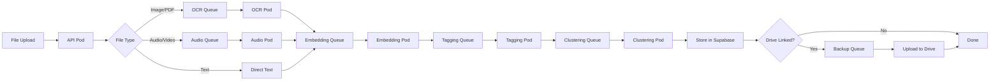

# Mindspace - DevOps & Infrastructure

Kubernetes-based scalable infrastructure for file processing, classification, and AI services.

---

## 🏗️ Architecture Overview

```
┌─────────────────────────────────────────────────────────────────────────────┐
│                              KUBERNETES CLUSTER                             │
│                                                                             │
│  ┌─────────────────────────────────────────────────────────────────────┐   │
│  │                         INGRESS CONTROLLER                          │   │
│  │                    (nginx / traefik / cloud LB)                     │   │
│  └───────────────────────────────┬─────────────────────────────────────┘   │
│                                  │                                          │
│  ┌───────────────────────────────┼──────────────────────────────────────┐  │
│  │                          API GATEWAY                                  │  │
│  │                    (Kong / Ambassador / Custom)                       │  │
│  └───────────────────────────────┬──────────────────────────────────────┘  │
│                                  │                                          │
│         ┌────────────────────────┼────────────────────────┐                │
│         │                        │                        │                │
│         ▼                        ▼                        ▼                │
│  ┌─────────────┐         ┌─────────────┐         ┌─────────────┐          │
│  │  API Pods   │         │ Processing  │         │  Scheduler  │          │
│  │(Py Backend) │         │   Pods      │         │    Pods     │          │
│  │ HPA: 2-10   │         │ HPA: 1-20   │         │  Single     │          │
│  └─────────────┘         └─────────────┘         └─────────────┘          │
│         │                        │                        │                │
│         └────────────────────────┼────────────────────────┘                │
│                                  │                                          │
│  ┌───────────────────────────────┼──────────────────────────────────────┐  │
│  │                         MESSAGE QUEUE                                 │  │
│  │                   (Redis / RabbitMQ / NATS)                          │  │
│  └───────────────────────────────┴──────────────────────────────────────┘  │
│                                                                             │
└─────────────────────────────────────────────────────────────────────────────┘
                                   │
                                   ▼
┌─────────────────────────────────────────────────────────────────────────────┐
│                           EXTERNAL SERVICES                                  │
│                                                                             │
│   ┌─────────────┐    ┌─────────────┐    ┌─────────────┐    ┌────────────┐  │
│   │  Supabase   │    │   Gemini    │    │   Google    │    │   Firebase │  │
│   │  (Postgres) │    │    API      │    │   Drive     │    │    FCM     │  │
│   └─────────────┘    └─────────────┘    └─────────────┘    └────────────┘  │
│                                                                             │
└─────────────────────────────────────────────────────────────────────────────┘
```

---

## 🎯 Pod Types

### 1. API Pods (Python Backend)

Handles REST API requests from Flutter app.

```yaml
# k8s/api-deployment.yaml
apiVersion: apps/v1
kind: Deployment
metadata:
  name: mindspace-api
  labels:
    app: mindspace
    component: api
spec:
  replicas: 2
  selector:
    matchLabels:
      app: mindspace
      component: api
  template:
    metadata:
      labels:
        app: mindspace
        component: api
    spec:
      containers:
      - name: api
        image: mindspace/api:latest
        ports:
        - containerPort: 8080
        resources:
          requests:
            memory: "256Mi"
            cpu: "250m"
          limits:
            memory: "512Mi"
            cpu: "500m"
        env:
        - name: SUPABASE_URL
          valueFrom:
            secretKeyRef:
              name: mindspace-secrets
              key: supabase-url
        - name: SUPABASE_KEY
          valueFrom:
            secretKeyRef:
              name: mindspace-secrets
              key: supabase-key
        - name: GEMINI_API_KEY
          valueFrom:
            secretKeyRef:
              name: mindspace-secrets
              key: gemini-api-key
        livenessProbe:
          httpGet:
            path: /health
            port: 8080
          initialDelaySeconds: 10
          periodSeconds: 5
        readinessProbe:
          httpGet:
            path: /ready
            port: 8080
          initialDelaySeconds: 5
          periodSeconds: 3
---
apiVersion: v1
kind: Service
metadata:
  name: mindspace-api
spec:
  selector:
    app: mindspace
    component: api
  ports:
  - port: 80
    targetPort: 8080
  type: ClusterIP
---
apiVersion: autoscaling/v2
kind: HorizontalPodAutoscaler
metadata:
  name: mindspace-api-hpa
spec:
  scaleTargetRef:
    apiVersion: apps/v1
    kind: Deployment
    name: mindspace-api
  minReplicas: 2
  maxReplicas: 10
  metrics:
  - type: Resource
    resource:
      name: cpu
      target:
        type: Utilization
        averageUtilization: 70
  - type: Resource
    resource:
      name: memory
      target:
        type: Utilization
        averageUtilization: 80
```

---

### 2. Processing Pods

Specialized pods for different processing tasks.

#### OCR Pod (Text Extraction)

```yaml
# k8s/processing/ocr-deployment.yaml
apiVersion: apps/v1
kind: Deployment
metadata:
  name: mindspace-ocr
  labels:
    app: mindspace
    component: ocr
spec:
  replicas: 2
  selector:
    matchLabels:
      app: mindspace
      component: ocr
  template:
    metadata:
      labels:
        app: mindspace
        component: ocr
    spec:
      containers:
      - name: ocr
        image: mindspace/ocr-worker:latest
        resources:
          requests:
            memory: "512Mi"
            cpu: "500m"
          limits:
            memory: "1Gi"
            cpu: "1000m"
        env:
        - name: REDIS_URL
          valueFrom:
            configMapKeyRef:
              name: mindspace-config
              key: redis-url
        - name: QUEUE_NAME
          value: "ocr-jobs"
---
apiVersion: autoscaling/v2
kind: HorizontalPodAutoscaler
metadata:
  name: mindspace-ocr-hpa
spec:
  scaleTargetRef:
    apiVersion: apps/v1
    kind: Deployment
    name: mindspace-ocr
  minReplicas: 1
  maxReplicas: 10
  metrics:
  - type: External
    external:
      metric:
        name: redis_queue_length
        selector:
          matchLabels:
            queue: ocr-jobs
      target:
        type: AverageValue
        averageValue: "5"
```

#### Embedding Pod

```yaml
# k8s/processing/embedding-deployment.yaml
apiVersion: apps/v1
kind: Deployment
metadata:
  name: mindspace-embedding
  labels:
    app: mindspace
    component: embedding
spec:
  replicas: 2
  selector:
    matchLabels:
      app: mindspace
      component: embedding
  template:
    metadata:
      labels:
        app: mindspace
        component: embedding
    spec:
      containers:
      - name: embedding
        image: mindspace/embedding-worker:latest
        resources:
          requests:
            memory: "1Gi"
            cpu: "500m"
            nvidia.com/gpu: 0  # Change to 1 if using GPU
          limits:
            memory: "2Gi"
            cpu: "1000m"
        env:
        - name: MODEL_NAME
          value: "all-MiniLM-L6-v2"
        - name: EMBEDDING_DIM
          value: "768"
        - name: REDIS_URL
          valueFrom:
            configMapKeyRef:
              name: mindspace-config
              key: redis-url
---
apiVersion: autoscaling/v2
kind: HorizontalPodAutoscaler
metadata:
  name: mindspace-embedding-hpa
spec:
  scaleTargetRef:
    apiVersion: apps/v1
    kind: Deployment
    name: mindspace-embedding
  minReplicas: 1
  maxReplicas: 5
  metrics:
  - type: External
    external:
      metric:
        name: redis_queue_length
        selector:
          matchLabels:
            queue: embedding-jobs
      target:
        type: AverageValue
        averageValue: "3"
```

#### Tagging Pod

```yaml
# k8s/processing/tagging-deployment.yaml
apiVersion: apps/v1
kind: Deployment
metadata:
  name: mindspace-tagging
  labels:
    app: mindspace
    component: tagging
spec:
  replicas: 2
  selector:
    matchLabels:
      app: mindspace
      component: tagging
  template:
    metadata:
      labels:
        app: mindspace
        component: tagging
    spec:
      containers:
      - name: tagging
        image: mindspace/tagging-worker:latest
        resources:
          requests:
            memory: "512Mi"
            cpu: "250m"
          limits:
            memory: "1Gi"
            cpu: "500m"
        env:
        - name: SPACY_MODEL
          value: "en_core_web_sm"
        - name: REDIS_URL
          valueFrom:
            configMapKeyRef:
              name: mindspace-config
              key: redis-url
```

#### Clustering Pod

```yaml
# k8s/processing/clustering-deployment.yaml
apiVersion: apps/v1
kind: Deployment
metadata:
  name: mindspace-clustering
  labels:
    app: mindspace
    component: clustering
spec:
  replicas: 1
  selector:
    matchLabels:
      app: mindspace
      component: clustering
  template:
    metadata:
      labels:
        app: mindspace
        component: clustering
    spec:
      containers:
      - name: clustering
        image: mindspace/clustering-worker:latest
        resources:
          requests:
            memory: "1Gi"
            cpu: "500m"
          limits:
            memory: "2Gi"
            cpu: "1000m"
        env:
        - name: ALGORITHM
          value: "hdbscan"
        - name: MIN_CLUSTER_SIZE
          value: "3"
        - name: REDIS_URL
          valueFrom:
            configMapKeyRef:
              name: mindspace-config
              key: redis-url
```

#### Audio Transcription Pod

```yaml
# k8s/processing/audio-deployment.yaml
apiVersion: apps/v1
kind: Deployment
metadata:
  name: mindspace-audio
  labels:
    app: mindspace
    component: audio
spec:
  replicas: 1
  selector:
    matchLabels:
      app: mindspace
      component: audio
  template:
    metadata:
      labels:
        app: mindspace
        component: audio
    spec:
      containers:
      - name: audio
        image: mindspace/audio-worker:latest
        resources:
          requests:
            memory: "2Gi"
            cpu: "1000m"
          limits:
            memory: "4Gi"
            cpu: "2000m"
        env:
        - name: WHISPER_MODEL
          value: "base"  # tiny, base, small, medium, large
        - name: REDIS_URL
          valueFrom:
            configMapKeyRef:
              name: mindspace-config
              key: redis-url
```

---

### 3. Scheduler Pod (Reminders)

Handles scheduled reminder notifications.

```yaml
# k8s/scheduler-deployment.yaml
apiVersion: apps/v1
kind: Deployment
metadata:
  name: mindspace-scheduler
  labels:
    app: mindspace
    component: scheduler
spec:
  replicas: 1  # Only one scheduler instance
  strategy:
    type: Recreate  # Prevent duplicate scheduling
  selector:
    matchLabels:
      app: mindspace
      component: scheduler
  template:
    metadata:
      labels:
        app: mindspace
        component: scheduler
    spec:
      containers:
      - name: scheduler
        image: mindspace/scheduler:latest
        resources:
          requests:
            memory: "128Mi"
            cpu: "100m"
          limits:
            memory: "256Mi"
            cpu: "200m"
        env:
        - name: SUPABASE_URL
          valueFrom:
            secretKeyRef:
              name: mindspace-secrets
              key: supabase-url
        - name: FCM_SERVER_KEY
          valueFrom:
            secretKeyRef:
              name: mindspace-secrets
              key: fcm-server-key
        - name: GEMINI_API_KEY
          valueFrom:
            secretKeyRef:
              name: mindspace-secrets
              key: gemini-api-key
        - name: CHECK_INTERVAL
          value: "60"  # Check for due reminders every 60 seconds
```

---

## 📬 Message Queue Configuration

### Redis Deployment

```yaml
# k8s/redis-deployment.yaml
apiVersion: apps/v1
kind: Deployment
metadata:
  name: mindspace-redis
  labels:
    app: mindspace
    component: redis
spec:
  replicas: 1
  selector:
    matchLabels:
      app: mindspace
      component: redis
  template:
    metadata:
      labels:
        app: mindspace
        component: redis
    spec:
      containers:
      - name: redis
        image: redis:7-alpine
        ports:
        - containerPort: 6379
        resources:
          requests:
            memory: "128Mi"
            cpu: "100m"
          limits:
            memory: "256Mi"
            cpu: "200m"
        volumeMounts:
        - name: redis-data
          mountPath: /data
      volumes:
      - name: redis-data
        persistentVolumeClaim:
          claimName: redis-pvc
---
apiVersion: v1
kind: Service
metadata:
  name: mindspace-redis
spec:
  selector:
    app: mindspace
    component: redis
  ports:
  - port: 6379
    targetPort: 6379
  type: ClusterIP
```

### Queue Structure

```
Redis Queues:
├── ocr-jobs          # Image/PDF text extraction
├── embedding-jobs    # Vector embedding generation
├── tagging-jobs      # Tag extraction
├── clustering-jobs   # Cluster assignment
├── audio-jobs        # Audio/video transcription
├── backup-jobs       # Google Drive backup
└── notification-jobs # FCM push notifications
```

---

## 🔄 Processing Pipeline

### Job Flow



### Job Message Format

```json
{
  "job_id": "uuid",
  "file_id": "uuid",
  "user_id": "uuid",
  "stage": "extracting",
  "payload": {
    "file_type": "image",
    "temp_storage_path": "/tmp/uploads/abc123.jpg"
  },
  "retry_count": 0,
  "created_at": "2026-01-14T00:00:00Z"
}
```

---

## 📊 Monitoring & Observability

### Prometheus Metrics

```yaml
# k8s/monitoring/prometheus-config.yaml
apiVersion: v1
kind: ConfigMap
metadata:
  name: prometheus-config
data:
  prometheus.yml: |
    global:
      scrape_interval: 15s
    
    scrape_configs:
      - job_name: 'mindspace-api'
        kubernetes_sd_configs:
          - role: pod
        relabel_configs:
          - source_labels: [__meta_kubernetes_pod_label_app]
            regex: mindspace
            action: keep
          - source_labels: [__meta_kubernetes_pod_label_component]
            regex: api
            action: keep
      
      - job_name: 'mindspace-workers'
        kubernetes_sd_configs:
          - role: pod
        relabel_configs:
          - source_labels: [__meta_kubernetes_pod_label_app]
            regex: mindspace
            action: keep
          - source_labels: [__meta_kubernetes_pod_label_component]
            regex: (ocr|embedding|tagging|clustering|audio)
            action: keep
```

### Key Metrics

| Metric                     | Description                          |
|----------------------------|--------------------------------------|
| `jobs_processed_total`     | Total jobs completed by type         |
| `job_duration_seconds`     | Processing time per job type         |
| `queue_length`             | Current items in each queue          |
| `api_request_duration`     | API response times                   |
| `gemini_api_calls_total`   | External AI API usage                |
| `file_upload_bytes_total`  | Total data processed                 |

---

## 🔐 Secrets Management

```yaml
# k8s/secrets.yaml
apiVersion: v1
kind: Secret
metadata:
  name: mindspace-secrets
type: Opaque
stringData:
  supabase-url: "https://xxx.supabase.co"
  supabase-key: "your-supabase-key"
  supabase-service-key: "your-service-key"
  gemini-api-key: "your-gemini-key"
  google-client-id: "your-google-client-id"
  google-client-secret: "your-google-client-secret"
  fcm-server-key: "your-fcm-key"
---
apiVersion: v1
kind: ConfigMap
metadata:
  name: mindspace-config
data:
  redis-url: "redis://mindspace-redis:6379"
  environment: "production"
  log-level: "info"
```

---

## 🚀 Deployment Strategy

### Rolling Updates

```yaml
# In each deployment
spec:
  strategy:
    type: RollingUpdate
    rollingUpdate:
      maxSurge: 1
      maxUnavailable: 0
```

### Blue-Green Deployment

```yaml
# k8s/blue-green/blue-deployment.yaml
apiVersion: apps/v1
kind: Deployment
metadata:
  name: mindspace-api-blue
  labels:
    app: mindspace
    component: api
    version: blue
spec:
  replicas: 2
  # ... rest of deployment

---
# k8s/blue-green/green-deployment.yaml
apiVersion: apps/v1
kind: Deployment
metadata:
  name: mindspace-api-green
  labels:
    app: mindspace
    component: api
    version: green
spec:
  replicas: 0  # Scale up when ready to switch
  # ... rest of deployment

---
# k8s/blue-green/service.yaml
apiVersion: v1
kind: Service
metadata:
  name: mindspace-api
spec:
  selector:
    app: mindspace
    component: api
    version: blue  # Switch to green for deployment
  ports:
  - port: 80
    targetPort: 8080
```

---

## 📦 Container Images

### Dockerfiles

#### API Image

```dockerfile
# docker/api/Dockerfile
FROM python:3.11-slim
WORKDIR /app
COPY requirements.txt .
RUN pip install --no-cache-dir -r requirements.txt
COPY . .
EXPOSE 8080
CMD ["python", "-m", "uvicorn", "app.main:app", "--host", "0.0.0.0", "--port", "8080"]
```

#### OCR Worker Image

```dockerfile
# docker/ocr/Dockerfile
FROM python:3.11-slim
RUN apt-get update && apt-get install -y \
    tesseract-ocr \
    libtesseract-dev \
    && rm -rf /var/lib/apt/lists/*
WORKDIR /app
COPY requirements.txt .
RUN pip install --no-cache-dir -r requirements.txt
COPY . .
CMD ["python", "worker.py"]
```

#### Embedding Worker Image

```dockerfile
# docker/embedding/Dockerfile
FROM python:3.11-slim
WORKDIR /app
COPY requirements.txt .
RUN pip install --no-cache-dir -r requirements.txt
# Pre-download model
RUN python -c "from sentence_transformers import SentenceTransformer; SentenceTransformer('all-MiniLM-L6-v2')"
COPY . .
CMD ["python", "worker.py"]
```

---

## 🌐 Ingress Configuration

```yaml
# k8s/ingress.yaml
apiVersion: networking.k8s.io/v1
kind: Ingress
metadata:
  name: mindspace-ingress
  annotations:
    kubernetes.io/ingress.class: nginx
    cert-manager.io/cluster-issuer: letsencrypt-prod
    nginx.ingress.kubernetes.io/proxy-body-size: "50m"
    nginx.ingress.kubernetes.io/proxy-read-timeout: "300"
spec:
  tls:
  - hosts:
    - api.mindspace.app
    secretName: mindspace-tls
  rules:
  - host: api.mindspace.app
    http:
      paths:
      - path: /
        pathType: Prefix
        backend:
          service:
            name: mindspace-api
            port:
              number: 80
```

---

## 📈 Scaling Guidelines

| Component      | Min | Max | Scale Trigger                    |
|----------------|-----|-----|----------------------------------|
| API Pods       | 2   | 10  | CPU > 70%, Memory > 80%          |
| OCR Pods       | 1   | 10  | Queue length > 5                 |
| Embedding Pods | 1   | 5   | Queue length > 3                 |
| Tagging Pods   | 1   | 5   | Queue length > 5                 |
| Clustering Pods| 1   | 3   | Queue length > 10                |
| Audio Pods     | 1   | 5   | Queue length > 2                 |

---

## 🔧 Helm Chart Structure (Optional)

```
charts/mindspace/
├── Chart.yaml
├── values.yaml
├── templates/
│   ├── api-deployment.yaml
│   ├── api-service.yaml
│   ├── api-hpa.yaml
│   ├── ocr-deployment.yaml
│   ├── embedding-deployment.yaml
│   ├── tagging-deployment.yaml
│   ├── clustering-deployment.yaml
│   ├── audio-deployment.yaml
│   ├── scheduler-deployment.yaml
│   ├── redis-deployment.yaml
│   ├── ingress.yaml
│   ├── secrets.yaml
│   └── configmap.yaml
└── README.md
```

---

## 🛠️ Local Development

### Docker Compose for Dev

```yaml
# docker-compose.dev.yaml
version: '3.8'
services:
  api:
    build: ./backend
    ports:
      - "8080:8080"
    environment:
      - REDIS_URL=redis://redis:6379
      - SUPABASE_URL=${SUPABASE_URL}
      - SUPABASE_KEY=${SUPABASE_KEY}
    depends_on:
      - redis
  
  ocr:
    build: ./workers/ocr
    environment:
      - REDIS_URL=redis://redis:6379
    depends_on:
      - redis
  
  embedding:
    build: ./workers/embedding
    environment:
      - REDIS_URL=redis://redis:6379
    depends_on:
      - redis
  
  redis:
    image: redis:7-alpine
    ports:
      - "6379:6379"
```

---

*This document provides the infrastructure foundation for the Mindspace system.*
