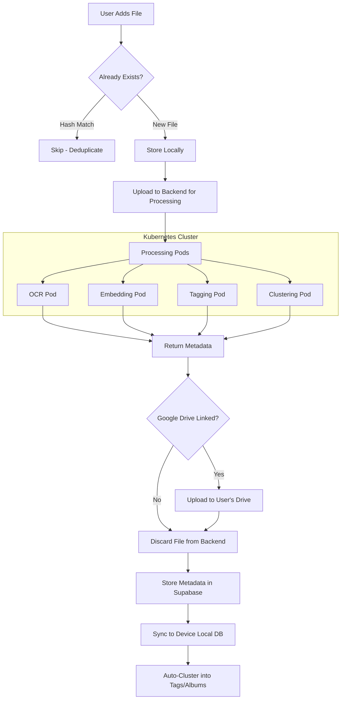
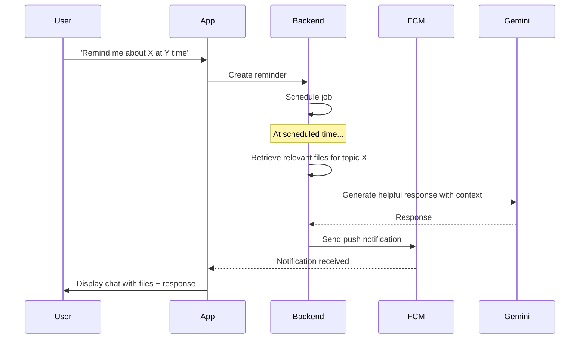

# Mindspace - Project Overview

A privacy-first, local-first personal knowledge management system combining on-device storage with cloud AI processing.

---

## 🎯 Vision

Build a system where users can:
- **Store files locally** on their device with optional Google Drive backup
- **Automatically extract** metadata, text, and semantic embeddings via cloud processing
- **Organize** content through AI-powered clustering and tagging (like smart albums)
- **Search** using both text and semantic queries across their entire device
- **Chat** with their data using Gemini API, with raw files displayed in responses
- **Get reminded** about topics with AI-generated notifications and relevant files

---

## ⚠️ Critical Privacy Constraints

> [!CAUTION]
> **The AI NEVER retains original user files.**

| What Happens                           | Privacy Status  |
|----------------------------------------|-----------------|
| Files stored locally on device         | ✅ User control |
| Optional backup to user's Google Drive | ✅ User control |
| Files uploaded to backend for processing | ⚠️ Temporary only |
| Extracted metadata/text stored in cloud | ✅ Safe to sync |
| Original files discarded after processing | ✅ Never stored |
| AI chat uses extracted data only       | ✅ Privacy preserved |

---

## 🏗️ High-Level Architecture

```
┌─────────────────────────────────────────────────────────────────┐
│                     USER DEVICE (Flutter)                       │
│  ┌─────────────────────────────────────────────────────────────┐│
│  │  Local Files    │  Local SQLite DB  │  UI + Notifications  ││
│  │  (images/video/ │  (syncs with      │  (chat, search,      ││
│  │   audio/pdf/txt)│   Supabase)       │   reminders, albums) ││
│  └────────┬────────┴─────────┬─────────┴────────────┬──────────┘│
└───────────┼──────────────────┼──────────────────────┼───────────┘
            │                  │                      │
            │ Upload for       │ Sync                 │ Push
            │ processing       │                      │ Notifications
            ▼                  ▼                      ▼
┌─────────────────────────────────────────────────────────────────┐
│                     CLOUD INFRASTRUCTURE                        │
│  ┌─────────────────┐  ┌──────────────┐  ┌───────────────────┐  │
│  │ Python Backend  │  │   Supabase   │  │   Notification    │  │
│  │   (Kubernetes)  │  │   (Postgres  │  │   Service (FCM)   │  │
│  │                 │  │   + pgvector)│  │                   │  │
│  │  ┌───────────┐  │  └──────────────┘  └───────────────────┘  │
│  │  │ Processing│  │                                           │
│  │  │ Pods:     │  │         ┌──────────────────┐              │
│  │  │ - OCR     │  │         │   Google Drive   │              │
│  │  │ - Embed   │  │         │   (User's own    │              │
│  │  │ - Tag     │  │         │    via API)      │              │
│  │  │ - Cluster │  │         └──────────────────┘              │
│  │  └───────────┘  │                                           │
│  └─────────────────┘                                           │
│                         ┌──────────────┐                       │
│                         │  Gemini API  │                       │
│                         │  (Chat only) │                       │
│                         └──────────────┘                       │
└─────────────────────────────────────────────────────────────────┘
```

---

## 🛠️ Tech Stack

| Layer              | Technology             | Purpose                              |
|--------------------|------------------------|--------------------------------------|
| **Frontend**       | Flutter                | Cross-platform UI (mobile + desktop) |
| **Local DB**       | SQLite / Hive          | On-device database, offline-first    |
| **Backend**        | Python + Kubernetes    | Scalable API + processing pods       |
| **Cloud DB**       | Supabase (Postgres)    | Metadata sync + vector storage       |
| **Vector Search**  | pgvector               | Semantic embeddings for search       |
| **Auth**           | Supabase Auth          | JWT-based authentication             |
| **Notifications**  | Firebase Cloud Messaging | Push notifications for reminders   |
| **Backup**         | Google Drive API       | Optional user-controlled backup      |
| **AI (Processing)**| Local models in pods   | OCR, embedding, tagging              |
| **AI (Chat)**      | Gemini API             | Conversational AI with context       |

---

## 📁 Storage Architecture

### On-Device (Primary)
```
/device-storage/mindspace/
├── files/                    ← Organized local files
│   ├── images/
│   ├── videos/
│   ├── audio/
│   ├── pdfs/
│   └── text/
├── thumbnails/               ← Generated previews
├── db/
│   └── mindspace.db          ← Local SQLite database
└── cache/                    ← Temporary processing cache
```

### Google Drive (Optional Backup)
```
/Mindspace Backup/
├── originals/               ← Full file backup
└── metadata.json            ← Sync manifest
```

---

## 🔄 Data Processing Pipeline



---

## 🔍 Search & Grouping

### Tag-Based Albums (Like Gallery Albums)
- Files auto-grouped by AI-generated clusters
- Similar to smart albums in photo galleries
- Tags derived from content, entities, and visual similarity

### Search Modes
| Mode       | How It Works                              |
|------------|-------------------------------------------|
| **Text**   | Full-text search on extracted content     |
| **Semantic** | Vector similarity on embeddings         |
| **Hybrid** | Combined scoring (default)               |
| **Tag**    | Browse by cluster/tag groups             |

---

## 💬 Chat System

### How Chat Works
1. User sends message in chat session
2. Query embedded → semantic search across ALL device files (with permission)
3. Relevant chunks retrieved from Supabase
4. Context built from metadata + extracted text
5. Gemini API generates response
6. **Raw files displayed inline** in chat UI (from local storage)
7. Citations link to original files

### Cross-Session Context
> [!IMPORTANT]
> Each chat session can access the user's FULL device context (files they've granted permission to), not just files from that session.

```
Chat Session A: "Show me my vacation photos"
  → Uses ALL indexed files on device
  → Returns relevant images displayed inline

Chat Session B: "What notes did I take about ML?"
  → Same full context access
  → Returns text files + relevant excerpts
```

---

## ⏰ Reminder System

### How Reminders Work
1. User: "Remind me to study machine learning tomorrow"
2. System creates scheduled reminder
3. At scheduled time → Push notification sent
4. Notification opens new chat with AI-generated response
5. Relevant files (ML notes, courses) attached to response

### Reminder Flow


---

## 📱 Sync Architecture

### Local-First with Cloud Sync
```
┌──────────────────┐         ┌──────────────────┐
│   Device SQLite  │ ◄─────► │   Supabase DB    │
│   (Primary)      │  Sync   │   (Backup/Sync)  │
└──────────────────┘         └──────────────────┘
        │
        │ Files stay local
        ▼
┌──────────────────┐
│  Local Storage   │
│  (images, etc.)  │
└──────────────────┘
```

### Sync Strategy
| Data Type      | Sync Direction           |
|----------------|--------------------------|
| File metadata  | Device ↔ Cloud (bidirectional) |
| Embeddings     | Cloud → Device (download) |
| Chat history   | Device ↔ Cloud          |
| Reminders      | Device ↔ Cloud          |
| **Raw files**  | **NEVER synced to cloud** |

---

## 🔐 Security Model

| Protection               | Implementation                          |
|--------------------------|-----------------------------------------|
| Row Level Security (RLS) | All Supabase tables protected per user  |
| Local DB encryption      | SQLite with encryption at rest          |
| File hashing             | SHA-256 for deduplication               |
| Auth                     | Supabase JWT with refresh tokens        |
| Google Drive             | OAuth 2.0 with user's own credentials   |
| Processing               | Files discarded immediately after       |

---

## 📊 File Tracking

Each file is tracked with:

| Field            | Purpose                                    |
|------------------|--------------------------------------------|
| `local_path`     | Absolute path on device                    |
| `google_drive_id`| Google Drive file ID (if backed up)        |
| `content_hash`   | SHA-256 hash for deduplication             |
| `last_modified`  | For sync conflict resolution               |

### Deduplication Logic
```
On file add:
1. Calculate hash
2. Check if hash exists in DB
3. If exists → Skip (same file, possibly moved)
4. If not → Process as new file
```

---

## 🎯 Core Features Summary

| Feature              | Description                              |
|----------------------|------------------------------------------|
| **Local-First**      | Files never leave device (except processing) |
| **Smart Albums**     | Auto-clustering into tag-based groups    |
| **AI Chat**          | Gemini-powered with full device context  |
| **Inline Files**     | Raw files displayed in chat responses    |
| **Reminders**        | Scheduled notifications with AI context  |
| **Google Drive**     | Optional backup to user's own account    |
| **Offline Mode**     | Full functionality without internet      |
| **Cross-Platform**   | Flutter for iOS, Android, Desktop        |

---

## 🚀 Scalability

- **Kubernetes** for container orchestration
- **Horizontal pod scaling** for processing workloads
- **Load balancing** across processing pods
- **Separate pods** for OCR, embedding, tagging, clustering
- **Queue-based** job distribution

*For DevOps details, see [DEVOPS.md](./DEVOPS.md)*
*For database schema, see [DATABASE_SCHEMA.md](./DATABASE_SCHEMA.md)*
*For AI integration, see [AI_INTEGRATION.md](./AI_INTEGRATION.md)*
