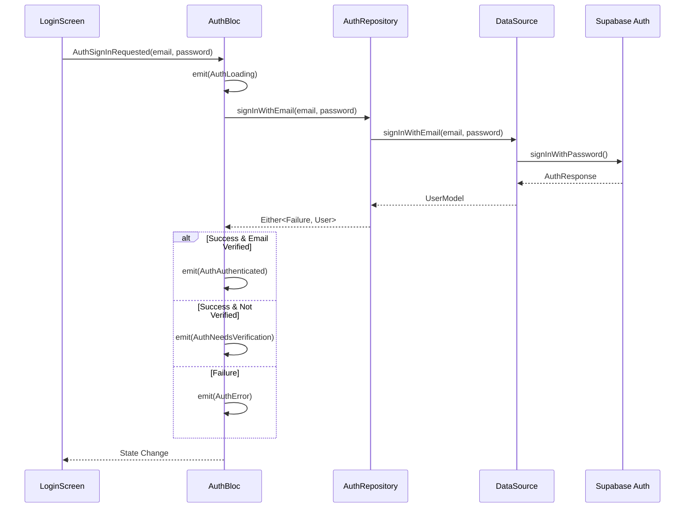
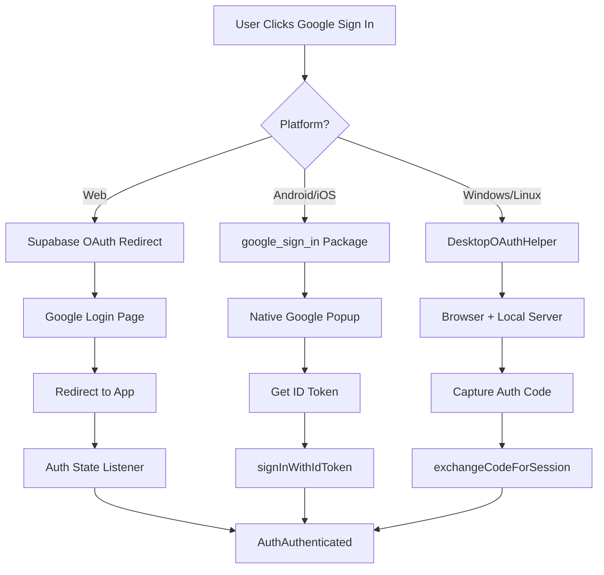

# Authentication Architecture

## Overview

The authentication system follows **Clean Architecture** principles, separating concerns into three distinct layers:

```
┌─────────────────────────────────────────────────────────────┐
│                    PRESENTATION LAYER                        │
│  ┌─────────────┐  ┌─────────────┐  ┌─────────────────────┐ │
│  │  AuthBloc   │  │   Screens   │  │   Widgets           │ │
│  │  (State)    │  │  (UI)       │  │  (Reusable)         │ │
│  └──────┬──────┘  └─────────────┘  └─────────────────────┘ │
└─────────┼───────────────────────────────────────────────────┘
          │
          ▼
┌─────────────────────────────────────────────────────────────┐
│                      DOMAIN LAYER                            │
│  ┌─────────────────────┐  ┌─────────────────────────────┐  │
│  │   AuthRepository    │  │     User Entity             │  │
│  │   (Abstract)        │  │     (Business Model)        │  │
│  └──────────┬──────────┘  └─────────────────────────────┘  │
└─────────────┼───────────────────────────────────────────────┘
              │
              ▼
┌─────────────────────────────────────────────────────────────┐
│                       DATA LAYER                             │
│  ┌─────────────────────┐  ┌─────────────────────────────┐  │
│  │ AuthRepositoryImpl  │  │  AuthRemoteDataSource       │  │
│  │ (Implementation)    │──│  (Supabase API)             │  │
│  └─────────────────────┘  └─────────────────────────────┘  │
│                           ┌─────────────────────────────┐  │
│                           │  DesktopOAuthHelper         │  │
│                           │  (Windows/Linux OAuth)      │  │
│                           └─────────────────────────────┘  │
└─────────────────────────────────────────────────────────────┘
```

## Data Flow

### Sign In Flow



### Google Sign In Flow (Platform-Specific)



## Layer Responsibilities

### Presentation Layer

| Component | Responsibility |
|-----------|----------------|
| `AuthBloc` | Manages auth state, handles events, emits states |
| `WelcomeScreen` | Landing page with Google/Email options |
| `LoginScreen` | Email/password sign in form |
| `SignupScreen` | Registration form with validation |
| `EmailVerificationScreen` | Pending verification state |
| `PasswordRecoveryScreen` | Password reset flow |

### Domain Layer

| Component | Responsibility |
|-----------|----------------|
| `User` | Business entity with id, email, emailVerified, displayName |
| `AuthRepository` | Abstract contract for auth operations |

### Data Layer

| Component | Responsibility |
|-----------|----------------|
| `AuthRepositoryImpl` | Implements repository, handles errors with Either |
| `AuthRemoteDataSource` | Direct Supabase API calls |
| `DesktopOAuthHelper` | OAuth flow for Windows/Linux |
| `UserModel` | Supabase user conversion |

## State Machine

```
                    ┌─────────────┐
                    │ AuthInitial │
                    └──────┬──────┘
                           │ AuthCheckRequested
                           ▼
                    ┌─────────────┐
              ┌─────│ AuthLoading │─────┐
              │     └─────────────┘     │
              │                         │
              ▼                         ▼
    ┌─────────────────┐    ┌────────────────────┐
    │ AuthAuthenticated│    │ AuthUnauthenticated│
    └────────┬────────┘    └──────────┬─────────┘
             │                        │
             │ SignOut                │ SignIn/SignUp
             │                        │
             └────────────────────────┘
                           │
                           ▼
              ┌────────────────────────┐
              │ AuthNeedsVerification  │
              │ (email not verified)   │
              └────────────────────────┘
```

## Dependency Injection

Dependencies are registered in `lib/core/di/injection_container.dart`:

```dart
// Data Sources
sl.registerLazySingleton<AuthRemoteDataSource>(
  () => AuthRemoteDataSourceImpl(supabaseClient: Supabase.instance.client),
);

// Repositories
sl.registerLazySingleton<AuthRepository>(
  () => AuthRepositoryImpl(dataSource: sl<AuthRemoteDataSource>()),
);

// BLoC
sl.registerFactory<AuthBloc>(
  () => AuthBloc(authRepository: sl<AuthRepository>()),
);
```

## Router Integration

Auth state is checked in `lib/core/router/app_router.dart`:

```dart
redirect: (context, state) {
  final authState = context.read<AuthBloc>().state;
  final isAuthRoute = state.matchedLocation.startsWith('/auth');
  
  if (authState is AuthAuthenticated && isAuthRoute) {
    return '/home';  // Redirect authenticated users away from auth
  }
  
  if (authState is AuthUnauthenticated && !isAuthRoute) {
    return '/auth/welcome';  // Redirect unauthenticated to login
  }
  
  return null;  // No redirect
}
```
