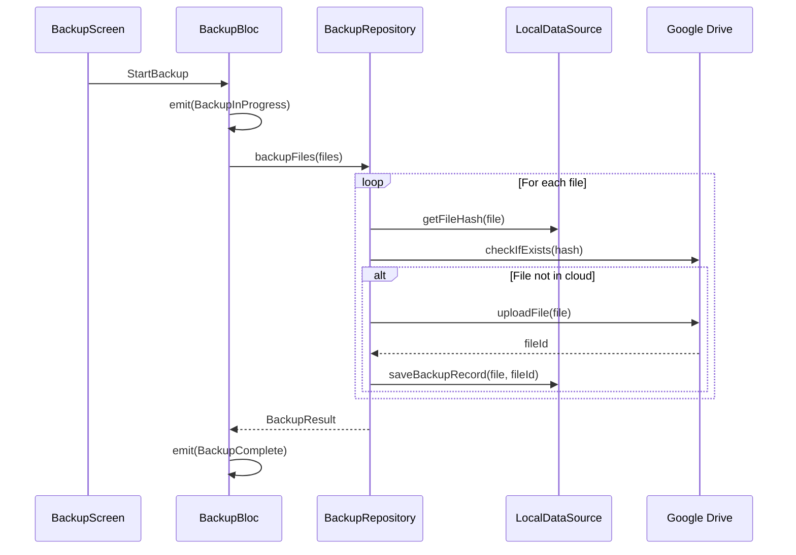
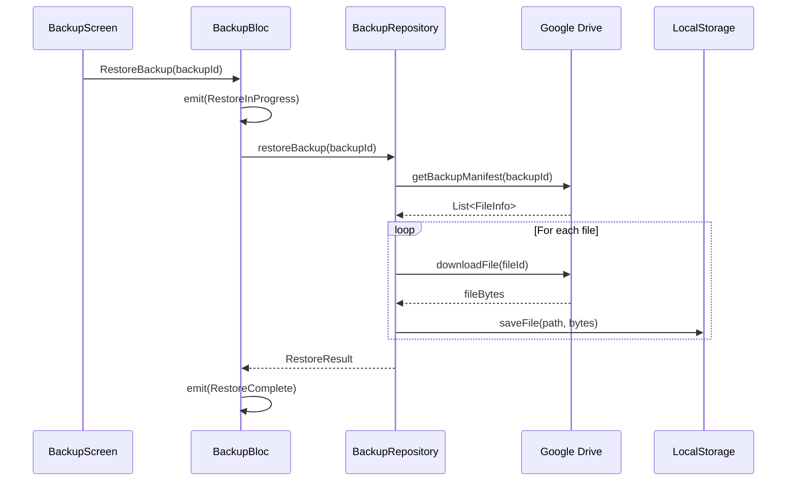

# Backup Architecture (Planned)

## Overview

The backup system will follow **Clean Architecture** principles with cloud integration:

```
┌─────────────────────────────────────────────────────────────┐
│                    PRESENTATION LAYER                        │
│  ┌─────────────┐  ┌─────────────┐  ┌─────────────────────┐ │
│  │ BackupBloc  │  │BackupScreen │  │   Widgets           │ │
│  │  (State)    │  │  (UI)       │  │  (Status, History)  │ │
│  └──────┬──────┘  └─────────────┘  └─────────────────────┘ │
└─────────┼───────────────────────────────────────────────────┘
          │
          ▼
┌─────────────────────────────────────────────────────────────┐
│                      DOMAIN LAYER                            │
│  ┌─────────────────────┐  ┌─────────────────────────────┐  │
│  │  BackupRepository   │  │    Backup Entity            │  │
│  │  (Abstract)         │  │    SyncStatus Enum          │  │
│  └──────────┬──────────┘  └─────────────────────────────┘  │
└─────────────┼───────────────────────────────────────────────┘
              │
              ▼
┌─────────────────────────────────────────────────────────────┐
│                       DATA LAYER                             │
│  ┌─────────────────────┐  ┌─────────────────────────────┐  │
│  │BackupRepositoryImpl │  │ BackupLocalDataSource       │  │
│  │ (Implementation)    │──│ (Local backup metadata)     │  │
│  └─────────────────────┘  └─────────────────────────────┘  │
│                           ┌─────────────────────────────┐  │
│                           │ BackupRemoteDataSource      │  │
│                           │ (Google Drive API)          │  │
│                           └─────────────────────────────┘  │
└─────────────────────────────────────────────────────────────┘
```

## Planned Data Flow

### Backup Flow



### Restore Flow



## Planned Entities

### Backup

```dart
class Backup extends Equatable {
  final String id;
  final DateTime createdAt;
  final int fileCount;
  final int totalSize;
  final BackupStatus status;
}

enum BackupStatus { 
  pending, 
  inProgress, 
  completed, 
  failed 
}
```

### SyncStatus

```dart
enum SyncStatus {
  synced,      // All files backed up
  pending,     // Changes waiting to sync
  syncing,     // Sync in progress
  error,       // Sync failed
  offline,     // No network
}
```

## Planned UI Components

### BackupStatusCard

```dart
class BackupStatusCard extends StatelessWidget {
  final SyncStatus status;
  final DateTime? lastBackup;
  final int pendingFiles;
  
  // Shows current sync state with visual indicator
}
```

### BackupHistoryList

```dart
class BackupHistoryList extends StatelessWidget {
  final List<Backup> backups;
  final Function(String) onRestore;
  
  // List of past backups with restore action
}
```

## Dependencies (Planned)

```yaml
dependencies:
  # Google Drive
  googleapis: ^12.0.0
  google_sign_in: ^6.2.1
  
  # Background tasks
  workmanager: ^0.5.2
  
  # File hashing
  crypto: ^3.0.3
```

## Configuration (Planned)

### Google Cloud Console Setup

1. Create Google Cloud project
2. Enable Google Drive API
3. Configure OAuth consent screen
4. Create OAuth 2.0 credentials
5. Add client IDs to app configuration

### Background Sync

```dart
// Initialize workmanager
Workmanager().initialize(callbackDispatcher);

// Schedule periodic backup
Workmanager().registerPeriodicTask(
  'backup-sync',
  'periodicBackup',
  frequency: Duration(hours: 6),
  constraints: Constraints(
    networkType: NetworkType.connected,
    requiresBatteryNotLow: true,
  ),
);
```
