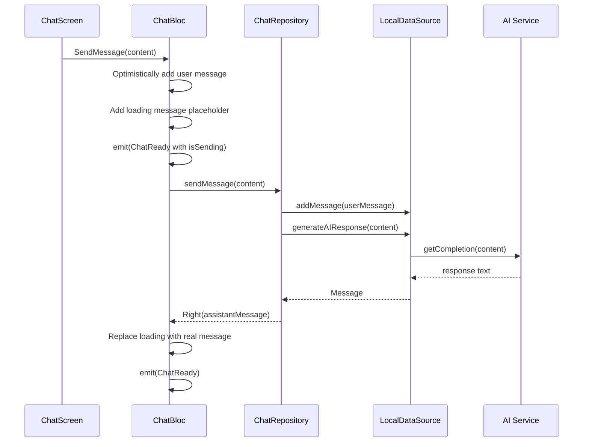
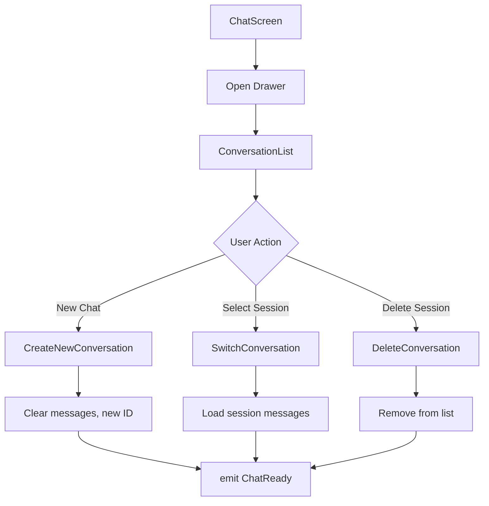

# Chat Architecture

## Overview

The chat system follows **Clean Architecture** principles with three distinct layers:

```
┌─────────────────────────────────────────────────────────────┐
│                    PRESENTATION LAYER                        │
│  ┌─────────────┐  ┌─────────────┐  ┌─────────────────────┐ │
│  │  ChatBloc   │  │ ChatScreen  │  │   Widgets           │ │
│  │  (State)    │  │  (UI)       │  │  (Bubbles, Input)   │ │
│  └──────┬──────┘  └─────────────┘  └─────────────────────┘ │
└─────────┼───────────────────────────────────────────────────┘
          │
          ▼
┌─────────────────────────────────────────────────────────────┐
│                      DOMAIN LAYER                            │
│  ┌─────────────────────┐  ┌─────────────────────────────┐  │
│  │   ChatRepository    │  │   Message Entity            │  │
│  │   (Abstract)        │  │   Conversation Entity       │  │
│  └──────────┬──────────┘  └─────────────────────────────┘  │
└─────────────┼───────────────────────────────────────────────┘
              │
              ▼
┌─────────────────────────────────────────────────────────────┐
│                       DATA LAYER                             │
│  ┌─────────────────────┐  ┌─────────────────────────────┐  │
│  │ ChatRepositoryImpl  │  │  ChatLocalDataSource        │  │
│  │ (Implementation)    │──│  (Mock/Local Storage)       │  │
│  └─────────────────────┘  └─────────────────────────────┘  │
│                           ┌─────────────────────────────┐  │
│                           │  AI Service (Future)        │  │
│                           │  (OpenAI/Anthropic/Local)   │  │
│                           └─────────────────────────────┘  │
└─────────────────────────────────────────────────────────────┘
```

## Data Flow

### Send Message Flow



### Session Management Flow



## State Machine

```
                    ┌─────────────┐
                    │ ChatInitial │
                    └──────┬──────┘
                           │ LoadChat
                           ▼
                    ┌─────────────┐
                    │ ChatLoading │
                    └──────┬──────┘
                           │
                           ▼
    ┌─────────────────────────────────────────────┐
    │                ChatReady                     │
    │  ┌─────────────────────────────────────┐   │
    │  │ messages: List<Message>              │   │
    │  │ conversations: List<Conversation>    │   │
    │  │ currentConversation: Conversation?   │   │
    │  │ isSending: bool                      │   │
    │  └─────────────────────────────────────┘   │
    └─────────────────────────────────────────────┘
                           │
                           ▼
                    ┌─────────────┐
                    │  ChatError  │
                    └─────────────┘
```

## Message Roles

| Role | Description | UI Position |
|------|-------------|-------------|
| `user` | Messages from the user | Right-aligned, accent color |
| `assistant` | AI responses | Left-aligned, surface color |

## Session Structure

```dart
class Conversation {
  final String id;           // Unique session ID
  final String title;        // Auto-generated from first message
  final DateTime createdAt;
  final DateTime updatedAt;
  final int messageCount;
}
```

## Dependency Injection

```dart
// Data Sources
sl.registerLazySingleton<ChatLocalDataSource>(
  () => ChatLocalDataSourceImpl(),
);

// Repositories
sl.registerLazySingleton<ChatRepository>(
  () => ChatRepositoryImpl(dataSource: sl<ChatLocalDataSource>()),
);

// BLoC
sl.registerFactory<ChatBloc>(
  () => ChatBloc(chatRepository: sl<ChatRepository>()),
);
```

## UI Component Hierarchy

```
ChatScreen
├── AppBar
│   ├── Menu Button (opens drawer)
│   ├── Title + Message Count
│   └── New Chat Button
├── Drawer
│   └── ConversationList
│       ├── New Conversation Button
│       └── List of ConversationTiles
├── Body
│   ├── Empty State (when no messages)
│   │   └── Suggestion Chips
│   └── MessageList
│       └── MessageBubble (per message)
└── ChatInput
    ├── Attachment Button (placeholder)
    ├── TextField
    └── Send Button (animated)
```
