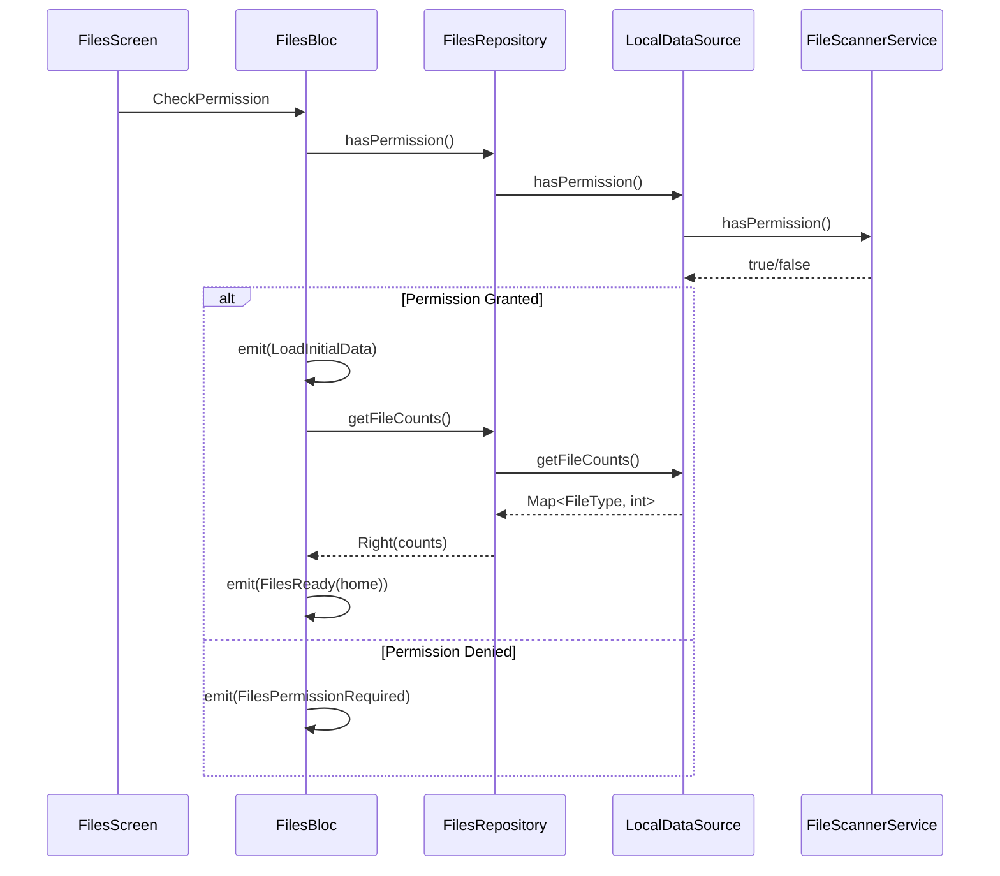
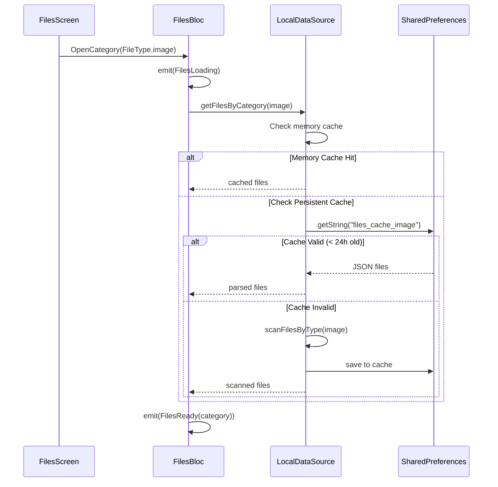
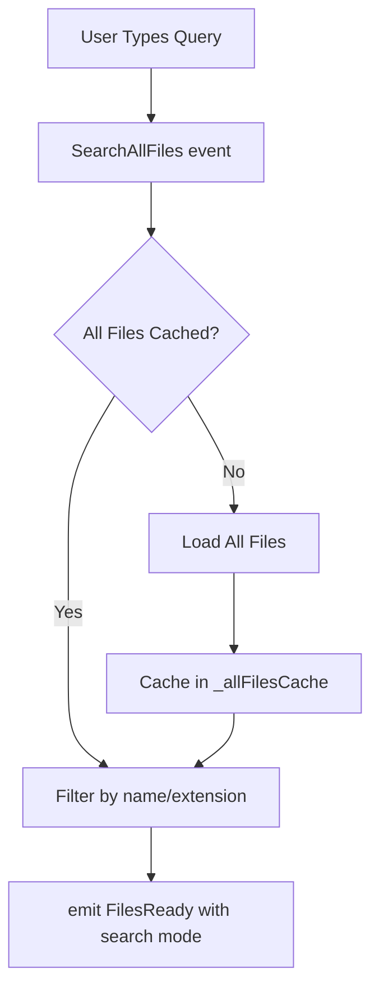

# Files Architecture

## Overview

The files system follows **Clean Architecture** principles with three distinct layers:

```
┌─────────────────────────────────────────────────────────────┐
│                    PRESENTATION LAYER                        │
│  ┌─────────────┐  ┌─────────────┐  ┌─────────────────────┐ │
│  │  FilesBloc  │  │FilesScreen  │  │   Widgets           │ │
│  │  (State)    │  │(Home/Files) │  │  (Cards, Sheets)    │ │
│  └──────┬──────┘  └─────────────┘  └─────────────────────┘ │
└─────────┼───────────────────────────────────────────────────┘
          │
          ▼
┌─────────────────────────────────────────────────────────────┐
│                      DOMAIN LAYER                            │
│  ┌─────────────────────┐  ┌─────────────────────────────┐  │
│  │  FilesRepository    │  │    FileItem Entity          │  │
│  │  (Abstract)         │  │    FileType Enum            │  │
│  └──────────┬──────────┘  └─────────────────────────────┘  │
└─────────────┼───────────────────────────────────────────────┘
              │
              ▼
┌─────────────────────────────────────────────────────────────┐
│                       DATA LAYER                             │
│  ┌─────────────────────┐  ┌─────────────────────────────┐  │
│  │ FilesRepositoryImpl │  │ FilesLocalDataSource        │  │
│  │ (Implementation)    │──│ (Caching + Access)          │  │
│  └─────────────────────┘  └─────────────────────────────┘  │
│                           ┌─────────────────────────────┐  │
│                           │  FileScannerService         │  │
│                           │  (Platform File Discovery)  │  │
│                           └─────────────────────────────┘  │
└─────────────────────────────────────────────────────────────┘
```

## Data Flow

### Load Home View



### Open Category Flow



### Search Flow



## State Machine

```
                    ┌─────────────┐
                    │FilesInitial │
                    └──────┬──────┘
                           │ CheckPermission
                           ▼
                    ┌──────────────────┐
              ┌─────│FilesCheckingPerm │─────┐
              │     └──────────────────┘     │
              ▼                              ▼
    ┌─────────────────┐          ┌──────────────────────┐
    │  FilesLoading   │          │FilesPermissionRequired│
    └────────┬────────┘          └──────────────────────┘
             │
             ▼
    ┌─────────────────────────────────────┐
    │            FilesReady               │
    │  ┌─────────────────────────────┐   │
    │  │ viewMode: home | category   │   │
    │  │           | search          │   │
    │  ├─────────────────────────────┤   │
    │  │ fileCounts: Map<FileType,int>│  │
    │  │ files: List<FileItem>        │  │
    │  │ selectedCategory: FileType?  │  │
    │  │ searchQuery: String          │  │
    │  └─────────────────────────────┘   │
    └─────────────────────────────────────┘
```

## View Modes

| Mode | Description | UI |
|------|-------------|-----|
| `home` | Default view | Category cards grid |
| `category` | Files in a category | File cards grid |
| `search` | Search results | Filtered files grid |

## Caching Strategy

```
┌─────────────────────────────────────────────┐
│              MEMORY CACHE                    │
│  Map<FileType, List<FileItemModel>>         │
│  - Fastest access                            │
│  - Lost on app restart                       │
└─────────────────────────────────────────────┘
                    ↓ fallback
┌─────────────────────────────────────────────┐
│           PERSISTENT CACHE                   │
│  SharedPreferences JSON                      │
│  - 24-hour TTL                               │
│  - Survives app restart                      │
└─────────────────────────────────────────────┘
                    ↓ fallback
┌─────────────────────────────────────────────┐
│           FILE SYSTEM SCAN                   │
│  FileScannerService                          │
│  - Full directory traversal                  │
│  - Slowest but most current                  │
└─────────────────────────────────────────────┘
```

## Dependency Injection

```dart
// Services
sl.registerLazySingleton<FileScannerService>(
  () => FileScannerService(),
);

// Data Sources
sl.registerLazySingleton<FilesLocalDataSource>(
  () => FilesLocalDataSourceImpl(scanner: sl<FileScannerService>()),
);

// Repositories
sl.registerLazySingleton<FilesRepository>(
  () => FilesRepositoryImpl(dataSource: sl<FilesLocalDataSource>()),
);

// BLoC
sl.registerFactory<FilesBloc>(
  () => FilesBloc(filesRepository: sl<FilesRepository>()),
);
```
